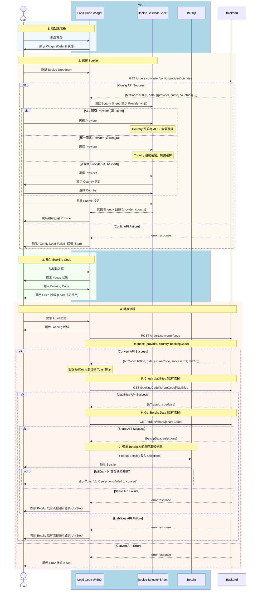

# Phase 1 - Code2Code Sequence Diagram (Basic)

> **版本**：1 - 基礎版（Business Logic + API + App State）  
> **來源**：PRD (2025-01-06 版本) + API Doc  
> **範圍**：Phase 1 - Competitor Code → Fcom Booking Code  
> **更新**：2025-01-06 - 修正轉換成功後的完整流程

---

## App 角色拆分說明

| 角色 | 說明 | 拆分依據 |
|------|------|----------|
| **Load Code Widget** | 主要輸入元件，負責 Bookie 選擇、Code 輸入、狀態顯示 | PRD 定義的「Load Code Widget」元件 |
| **Bookie Selector Sheet** | Bottom Sheet 選擇器，負責 Provider 和 Country 選擇 | PRD 流程中的「選擇 Bookie」步驟為獨立互動 |
| **Betslip** | 投注單，負責載入轉換後的 selections | PRD 定義的結果顯示終點，獨立的功能模組 |

**拆分理由**：
1. **PRD 流程定義**：PRD 明確描述了 Widget → Bottom Sheet → Betslip 的互動流程
2. **功能職責分離**：每個元件有明確的單一職責
3. **狀態獨立性**：各元件有獨立的 UI 狀態（Widget: Default/Focus/Loading/Error, Betslip: 載入 selections）

---

## 主流程：Code2Code 轉換



---

## 完整流程圖

```
┌─────────────────────────────────────────────────────────────────────────┐
│                         Code2Code 轉換流程                               │
├─────────────────────────────────────────────────────────────────────────┤
│                                                                          │
│  1. GET /config/providerCountries                                        │
│     ├─ Success → 顯示 Bookie Selector Sheet                              │
│     └─ Failure → "Config Load Failed" (Stop)                             │
│                                                                          │
│  2. User 選擇 Provider + Country → 點擊 Submit → 關閉 Sheet              │
│                                                                          │
│  3. User 輸入 Booking Code                                               │
│                                                                          │
│  4. POST /orders/converter/code                                          │
│     ├─ Success → 取得 {shareCode, successCnt, failCnt}                   │
│     │                                                                    │
│     │   5. GET /bookingCode/[shareCode]/liabilities [既有流程]           │
│     │      ├─ Success → 取得 {isTrusted}                                 │
│     │      │                                                             │
│     │      │   6. GET /orders/share/[shareCode] [既有流程]               │
│     │      │      ├─ Success → 取得 {betslipData}                        │
│     │      │      │                                                      │
│     │      │      │   7. Pop up Betslip                                  │
│     │      │      │      ├─ 顯示 selections                              │
│     │      │      │      └─ 若 failCnt > 0 → Toast 提示失敗數量          │
│     │      │      │                                                      │
│     │      │      └─ Failure → Betslip 既有錯誤 UI (Stop)                │
│     │      │                                                             │
│     │      └─ Failure → Betslip 既有錯誤 UI (Stop)                       │
│     │                                                                    │
│     └─ Failure → Error 狀態 (Stop)                                       │
│                                                                          │
└─────────────────────────────────────────────────────────────────────────┘
```

---

## App 狀態變化

| 階段 | Widget 狀態 | 說明 |
|------|-------------|------|
| 初始化 | Default | 預設顯示，等待使用者操作 |
| 點擊輸入框 | Focus | 輸入框聚焦，準備輸入 |
| 輸入中 | Typing | 顯示清除按鈕 |
| 輸入完成 | Filled | Load 按鈕啟用 |
| 轉換中 | Loading | 顯示載入動畫和提示文字 |
| 轉換失敗 | Error | 顯示錯誤訊息，可重試 |
| 轉換成功 | → Betslip | Pop up Betslip |

---

## API 調用順序

| 順序 | API | Method | 用途 | 失敗處理 |
|:----:|-----|--------|------|----------|
| 1 | `/orders/converter/config/providerCountries` | `GET` | 取得 Provider 和 Country 列表 | "Config Load Failed" |
| 2 | `/orders/converter/code` | `POST` | 執行 Code 轉換 | Error 狀態 |
| 3 | `/bookingCode/[shareCode]/liabilities` | `GET` | 檢查 Liabilities [既有流程] | Betslip 既有錯誤 UI |
| 4 | `/orders/share/[shareCode]` | `GET` | 取得 Betslip 資料 [既有流程] | Betslip 既有錯誤 UI |

---

## Response 使用方式

### 1. GET /orders/converter/config/providerCountries

```json
{
  "bizCode": 10000,
  "data": [
    { "provider": "bet9ja", "name": "Bet9ja", "countries": ["NG"] },
    { "provider": "msport", "name": "MSport", "countries": ["NG", "GH", "UG", "ZM"] }
  ]
}
```

**使用方式**：
- `data` 陣列 → 渲染 Bookie Selector Sheet 列表
- `countries == ["ALL"]` → Country 預設為 ALL，無需選擇
- `countries.length == 1` → 自動選定國家，無需選擇
- `countries.length > 1` → 顯示 Country 子選單供選擇

### 2. POST /orders/converter/code

```json
{
  "bizCode": 10000,
  "data": {
    "shareCode": "ABC123",
    "successCnt": 5,
    "failCnt": 1
  }
}
```

**使用方式**：
- `shareCode` → 用於後續 API 調用
- `failCnt` → 記錄，在 Betslip 顯示時用於 Toast 提示

### 3. GET /bookingCode/[shareCode]/liabilities [既有流程]

```json
{
  "isTrusted": true
}
```

**使用方式**：
- 驗證 shareCode 的有效性

### 4. GET /orders/share/[shareCode] [既有流程]

```json
{
  "betslipData": {
    "selections": [...]
  }
}
```

**使用方式**：
- `betslipData` → 用於渲染 Betslip 內容

---

## Toast 顯示邏輯

| 條件 | 顯示 |
|------|------|
| `failCnt == 0` | 無 Toast |
| `failCnt > 0` | "⚠ {failCnt} selections failed to convert" |

---

## 備註

- 📍 **PRD 來源**：`../01_PRD/01_06/Fcom_PRD_Booking_Code_Converter_01_06_zh-TW.md`
- 📍 **API 文件**：`../API_Doc/Code_Converter_API_Doc.md`
