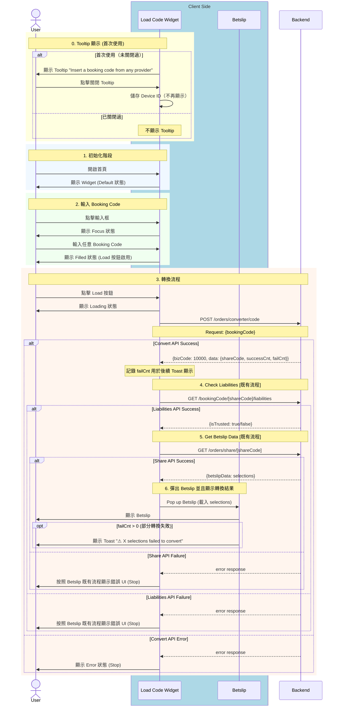

# Phase 1 - Code2Code Sequence Diagram (Basic)

> **版本**：2 - 基礎版（Business Logic + API + App State）  
> **來源**：PRD (2025-01-06 版本) + API Doc + BE 新設計 (2025-01-14)  
> **範圍**：Phase 1 - Any Booking Code → Fcom Booking Code  
> **更新**：2025-01-14 - BE 新設計：移除 Provider/Country 選擇，新增 Tooltip

---

## ⚠️ BE 新設計更新 (2025-01-14)

| 變更項目 | 舊版 | 新版 |
|----------|------|------|
| **Provider/Country 選擇** | 需先選擇 Bookie | ❌ 廢棄 - BE 自動識別 |
| **Config API** | `GET /orders/converter/config/providerCountries` | ❌ 廢棄 |
| **Convert API** | `{provider, country, bookingCode}` | `{bookingCode}` |
| **Bookie Selector Sheet** | 需實作 | ❌ 廢棄 |
| **Tooltip** | 無 | 🆕 新增 - 首次使用引導 |

---

## App 角色拆分說明

| 角色 | 說明 | 拆分依據 |
|------|------|----------|
| **Load Code Widget** | 主要輸入元件，負責 Code 輸入、狀態顯示、Tooltip | PRD 定義的「Load Code Widget」元件 |
| ~~**Bookie Selector Sheet**~~ | ~~Bottom Sheet 選擇器~~ | ❌ 廢棄 |
| **Betslip** | 投注單，負責載入轉換後的 selections | PRD 定義的結果顯示終點 |

---

## 主流程：Code2Code 轉換

---

## API 調用順序

| 順序 | API | Method | 說明 | 狀態 |
|:----:|-----|--------|------|------|
| ~~1~~ | ~~`/orders/converter/config/providerCountries`~~ | ~~GET~~ | ~~取得 Provider 設定~~ | ❌ 廢棄 |
| 1 | `/orders/converter/code` | POST | 轉換 Booking Code (只需 bookingCode) | ✅ |
| 2 | `/bookingCode/{shareCode}/liabilities` | GET | 檢查 Liabilities（既有流程） | ✅ |
| 3 | `/orders/share/{shareCode}` | GET | 取得 Betslip Data（既有流程） | ✅ |

---

## Widget 狀態變化

| 狀態 | 觸發條件 | UI 表現 |
|------|----------|---------|
| Default | 初始 / 載入成功後 | 無邊框，Load 按鈕灰色 |
| Focus | 點擊輸入框 | 綠色邊框 |
| Typing | 輸入文字中 | 綠色邊框，清除按鈕顯示 |
| Filled | 輸入完成失焦 | 無邊框，Load 按鈕綠色 |
| Loading | 點擊 Load | 顯示 Spinner + 提示文字 |
| Error | API 失敗 | 紅色邊框 + 錯誤訊息 |

---

## Tooltip 行為

| 項目 | 說明 |
|------|------|
| **顯示時機** | 功能上線後首次使用 |
| **顯示內容** | "Insert a booking code from any provider" |
| **消失條件** | User 點擊關閉 |
| **儲存方式** | Device ID (UserDefaults) |
| **跨入口同步** | 任一入口關閉後，所有入口皆不再顯示 |

---

## 廢棄項目

| 項目 | 類型 | 原因 |
|------|------|------|
| Bookie Selector Sheet | UI | 不再需要選擇 Provider |
| Config API | API | BE 新設計不需要 |
| `provider` 參數 | Request | BE 自動識別 |
| `country` 參數 | Request | BE 自動識別 |
