# Phase 1 - Code2Code Sequence Diagram (With Figma)

> **版本**：2 - 含 Figma 資訊  
> **來源**：PRD (2025-01-06 版本) + API Doc + Figma 設計稿  
> **範圍**：Phase 1 - Competitor Code → Fcom Booking Code  
> **更新**：2025-01-06 - 修正轉換成功後的完整流程

---

## App 角色拆分說明

| 角色 | 說明 | Figma 對應 |
|------|------|------------|
| **Load Code Widget** | 主要輸入元件 | Frame 1.0.0 ~ 1.0.6, 1.0.8 |
| **Bookie Selector Sheet** | Bottom Sheet 選擇器 | Frame 1.0.3 子畫面 |
| **Betslip** | 投注單 | Betslip Success/Partial Frame |

---

## 主流程：Code2Code 轉換

```mermaid
sequenceDiagram
    actor User
    
    box rgb(173, 216, 230) Client Side
        participant Widget as Load Code Widget
        participant Selector as Bookie Selector Sheet
        participant Betslip as Betslip
    end
    
    participant BE as Backend

    %% 1. 初始化階段
    rect rgb(240, 248, 255)
        note over User,Widget: 1. 初始化階段
        note over Widget: 📐 Figma: 1.0.0 Default
        User->>Widget: 開啟首頁
        Widget->>User: 顯示 Widget (Default 狀態)
    end

    %% 2. 選擇 Bookie (含 Config API)
    rect rgb(255, 250, 240)
        note over User,Selector: 2. 選擇 Bookie
        note over Selector: 📐 Figma: 1.0.3 開啟選單
        User->>Widget: 點擊 Bookie Dropdown
        Widget->>BE: GET /orders/converter/config/providerCountries
        
        alt Config API Success
            BE-->>Widget: {bizCode: 10000, data: [{provider, name, countries}...]}
            Widget->>Selector: 開啟 Bottom Sheet
            
            alt ALL 國家 Provider (如 Fcom)
                note over Selector: 📐 Figma: 1.0.3 (node: 26921:96820)
                User->>Selector: 選擇 Provider
                note over Selector: Country 預設為 ALL，無需選擇
            else 單一國家 Provider (如 Bet9ja)
                note over Selector: 📐 Figma: 1.0.3 單一國家 Bookie
                User->>Selector: 選擇 Provider
                note over Selector: Country 自動選定，無需選擇
            else 多國家 Provider (如 MSport)
                note over Selector: 📐 Figma: 1.0.3 多國家 Bookie
                User->>Selector: 選擇 Provider
                Selector->>User: 顯示 Country 列表
                note over Selector: 📐 Figma: 1.0.3 選擇 Country
                User->>Selector: 選擇 Country
            end
            
            note over Selector: 📐 Figma: 1.0.3 (node: 26921:96820)
            User->>Selector: 點擊 Submit 按鈕
            note over Selector: 📐 Figma: 1.0.3 結果-最終狀態
            Selector-->>Widget: 關閉 Sheet + 回傳 {provider, country}
            Widget->>User: 更新顯示已選 Provider
        
        else Config API Failure
            BE-->>Widget: error response
            Widget->>User: 顯示 "Config Load Failed" 錯誤 (Stop)
        end
    end

    %% 3. 輸入 Booking Code
    rect rgb(240, 255, 240)
        note over User,Widget: 3. 輸入 Booking Code
        note over Widget: 📐 Figma: 1.0.1 Focus
        User->>Widget: 點擊輸入框
        Widget->>User: 顯示 Focus 狀態 (綠色邊框)
        note over Widget: 📐 Figma: 1.0.2 Typing
        User->>Widget: 輸入 Booking Code
        note over Widget: 📐 Figma: 1.0.4 Filled
        Widget->>User: 顯示 Filled 狀態 (Load 按鈕啟用)
    end

    %% 4. 轉換流程
    rect rgb(255, 245, 238)
        note over User,BE: 4. 轉換流程
        User->>Widget: 點擊 Load 按鈕
        note over Widget: 📐 Figma: 1.0.5 Loading
        Widget->>User: 顯示 Loading 狀態
        note right of Widget: "Conversion may take up to 10 seconds..."
        
        Widget->>BE: POST /orders/converter/code
        note over Widget,BE: Request: {provider, country, bookingCode}
        
        alt Convert API Success
            BE-->>Widget: {bizCode: 10000, data: {shareCode, successCnt, failCnt}}
            note over Widget: 記錄 failCnt 用於後續 Toast 顯示
            
            %% 5. Check Liabilities [既有流程]
            note over Widget,BE: 5. Check Liabilities [既有流程]
            Widget->>BE: GET /bookingCode/[shareCode]/liabilities
            
            alt Liabilities API Success
                BE-->>Widget: {isTrusted: true/false}
                
                %% 6. Get Betslip Data [既有流程]
                note over Widget,BE: 6. Get Betslip Data [既有流程]
                Widget->>BE: GET /orders/share/[shareCode]
                
                alt Share API Success
                    BE-->>Widget: {betslipData: selections}
                    
                    %% 7. 彈出 Betslip 並且顯示轉換結果
                    note over Widget,Betslip: 7. 彈出 Betslip 並且顯示轉換結果
                    note over Widget: 📐 Figma: 1.0.8 Success
                    Widget->>Betslip: Pop up Betslip (載入 selections)
                    note over Betslip: 📐 Figma: Betslip Success
                    Betslip->>User: 顯示 Betslip
                    
                    opt failCnt > 0 (部分轉換失敗)
                        note over Betslip: 📐 Figma: Betslip Partial
                        Betslip->>User: 顯示 Toast "⚠ X selections failed to convert"
                    end
                    
                else Share API Failure
                    BE-->>Widget: error response
                    Widget->>User: 按照 Betslip 既有流程顯示錯誤 UI (Stop)
                end
                
            else Liabilities API Failure
                BE-->>Widget: error response
                Widget->>User: 按照 Betslip 既有流程顯示錯誤 UI (Stop)
            end
            
        else Convert API Error
            note over Widget: 📐 Figma: 1.0.6 Error
            BE-->>Widget: error response
            Widget->>User: 顯示 Error 狀態 (Stop)
        end
    end
```



---

## Figma Frame 對應表

| 流程階段 | Figma Frame | Node ID | Widget 狀態 |
|----------|-------------|---------|-------------|
| 初始化 | 1.0.0 | `26453:93262` | Default |
| 輸入框聚焦 | 1.0.1 | - | Focus |
| 正在輸入 | 1.0.2 | - | Typing |
| 選擇 Bookie | 1.0.3 | `26753:64425` | Focus + Bottom Sheet |
| 輸入完成 | 1.0.4 | `26453:93265` | Filled |
| 轉換中 | 1.0.5 | - | Loading |
| 轉換失敗 | 1.0.6 | - | Error |
| 轉換成功 | 1.0.8 | `26453:93267` | → Betslip |

### 1.0.3 子畫面 (Bookie Selector Sheet)

| 狀態 | Node ID | 說明 |
|------|---------|------|
| 開啟選單 | `26753:64425` | Bottom Sheet 初始狀態 |
| 單一國家 Bookie | `26753:64562` | 如 Bet9ja (NG only) |
| 多國家 Bookie | `26753:64699` | 如 Bangbet |
| 選擇 Country | `26753:64836` | Country 子選單 |
| Click mask to close | `26753:64973` | 點擊遮罩關閉 |
| **Submit 按鈕** | `26921:96820` | 點擊後關閉 Sheet 並更新 Widget |
| 結果 - 最終狀態 | `26753:85011` | 選擇完成 |

### Load Code Widget 獨立狀態

| 狀態 | Node ID |
|------|---------|
| Default | `26769:88873` |
| Focus | `26769:88868` |
| Typing | - |
| Filled | - |
| Loading | - |
| Error | - |

### Betslip 結果狀態

| 狀態 | Node ID | 說明 |
|------|---------|------|
| Success | `26428:71768` | failCnt == 0 |
| Partial | `26428:71769` | failCnt > 0，顯示 Toast |

---

## API 調用順序

| 順序 | API | Method | Figma 狀態 | 失敗處理 |
|:----:|-----|--------|------------|----------|
| 1 | `/orders/converter/config/providerCountries` | `GET` | 1.0.3 | Config Load Failed |
| 2 | `/orders/converter/code` | `POST` | 1.0.5 Loading | 1.0.6 Error |
| 3 | `/bookingCode/[shareCode]/liabilities` | `GET` | [既有流程] | Betslip 既有錯誤 UI |
| 4 | `/orders/share/[shareCode]` | `GET` | [既有流程] | Betslip 既有錯誤 UI |

---

## Response 使用方式

### POST /orders/converter/code

| 欄位 | 用途 | Figma 對應 |
|------|------|------------|
| `shareCode` | 用於後續 API 調用 | - |
| `successCnt` | 成功數量 | - |
| `failCnt` | 失敗數量，決定 Toast 顯示 | Betslip Partial |

**結果判斷**：

| 條件 | Figma Frame | 處理 |
|------|-------------|------|
| API Success | 1.0.8 + Betslip Success | 繼續呼叫後續 API |
| API Error | 1.0.6 Error | 顯示錯誤訊息 |
| `failCnt > 0` | Betslip Partial | 顯示 Toast 提示 |

---

## Bookie Selector Sheet 互動流程

```
┌─────────────────────────────────────────────────────────────────┐
│  User 點擊 Bookie Dropdown                                       │
│     ↓                                                            │
│  GET /config/providerCountries                                   │
│     ↓                                                            │
│  開啟 Bookie Selector Sheet (📐 1.0.3)                           │
│     ↓                                                            │
│  User 選擇 Provider                                              │
│     ├─ ALL 國家 (如 Fcom) → Country 預設為 ALL，無需選擇         │
│     ├─ 單一國家 (如 Bet9ja) → 自動選定 Country，無需選擇         │
│     └─ 多國家 (如 MSport) → 顯示 Country 列表 → User 選擇        │
│     ↓                                                            │
│  User 點擊 Submit 按鈕 (📐 node: 26921:96820)                    │
│     ↓                                                            │
│  關閉 Bookie Selector Sheet                                      │
│     ↓                                                            │
│  更新 Load Code Widget 顯示已選 Provider                         │
└─────────────────────────────────────────────────────────────────┘
```

### Provider 類型對照表

| 類型 | 範例 | `countries` 值 | Country 選擇行為 |
|------|------|----------------|------------------|
| **ALL 國家** | Fcom | `["ALL"]` | 預設為 ALL，無需選擇 |
| **單一國家** | Bet9ja | `["NG"]` | 自動選定，無需選擇 |
| **多國家** | MSport | `["NG", "GH", "UG", "ZM"]` | 需要選擇 Country |

---

## 備註

- 📍 **Figma 來源**：`../02_Design/Figma_Nodes_Phase1.md`
- 📍 **PRD 來源**：`../01_PRD/01_06/Fcom_PRD_Booking_Code_Converter_01_06_zh-TW.md`
- 📍 **API 文件**：`../API_Doc/Code_Converter_API_Doc.md`
- 📍 **設計規格**：`../02_Design/Phase1_Design_Specs.md`
- 📍 **Submit 按鈕 Figma**：[node 26921:96820](https://www.figma.com/design/SvcTlADMZ7gUPIa7nN2hT1/Code-Converter?node-id=26921-96820&m=dev)
