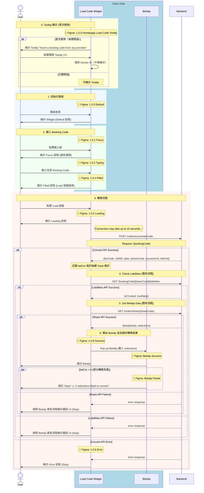

# Phase 1 - Code2Code Sequence Diagram (With Figma)

> **版本**：3 - 含 Figma 資訊  
> **來源**：PRD (2025-01-06 版本) + API Doc + Figma 設計稿 + BE 新設計 (2025-01-14)  
> **範圍**：Phase 1 - Any Booking Code → Fcom Booking Code  
> **更新**：2025-01-14 - BE 新設計：移除 Provider/Country 選擇，新增 Tooltip

---

## ⚠️ BE 新設計更新 (2025-01-14)

| 變更項目 | 舊版 | 新版 |
|----------|------|------|
| **Provider/Country 選擇** | 需先選擇 Bookie | ❌ 廢棄 - BE 自動識別 |
| **Config API** | `GET /orders/converter/config/providerCountries` | ❌ 廢棄 |
| **Bookie Selector Sheet** | Figma 1.0.3 | ❌ 廢棄 - 不需實作 |
| **Tooltip** | 無 | 🆕 Figma 1.0.0 Tooltip |

---

## App 角色拆分說明

| 角色 | 說明 | Figma 對應 |
|------|------|------------|
| **Load Code Widget** | 主要輸入元件 | Frame 1.0.0 ~ 1.0.6, 1.0.8 |
| ~~**Bookie Selector Sheet**~~ | ~~Bottom Sheet 選擇器~~ | ~~Frame 1.0.3~~ ❌ 廢棄 |
| **Betslip** | 投注單 | Betslip Success/Partial Frame |

---

## 主流程：Code2Code 轉換

---

## Figma Frame 對應表

| 流程階段 | Figma Frame | 狀態 |
|----------|-------------|------|
| Tooltip 顯示 | 1.0.0 Homepage Load Code Tooltip | 🆕 新增 |
| Widget 預設 | 1.0.0 Default | ✅ |
| 輸入框聚焦 | 1.0.1 Focus | ✅ |
| 正在輸入 | 1.0.2 Typing | ✅ |
| ~~Bookie 選擇~~ | ~~1.0.3~~ | ❌ 廢棄 |
| 輸入完成 | 1.0.4 Filled | ✅ |
| 轉換中 | 1.0.5 Loading | ✅ |
| 轉換失敗 | 1.0.6 Error | ✅ |
| 轉換成功 | 1.0.8 Success | ✅ |
| Betslip 成功 | Betslip Success | ✅ |
| Betslip 部分成功 | Betslip Partial | ✅ |

---

## API 調用順序

| 順序 | API | Method | Figma 狀態 | 失敗處理 | 狀態 |
|:----:|-----|--------|------------|----------|------|
| ~~1~~ | ~~`/orders/converter/config/providerCountries`~~ | ~~GET~~ | ~~1.0.3~~ | ~~Error~~ | ❌ 廢棄 |
| 1 | `/orders/converter/code` | POST | 1.0.5 Loading | 1.0.6 Error | ✅ |
| 2 | `/bookingCode/{shareCode}/liabilities` | GET | [既有流程] | Betslip 既有錯誤 UI | ✅ |
| 3 | `/orders/share/{shareCode}` | GET | [既有流程] | Betslip 既有錯誤 UI | ✅ |

---

## 廢棄的 Figma Frame

| Frame | 說明 | 原因 |
|-------|------|------|
| 1.0.3 開啟選單 | Bookie Selector Sheet | 不再需要選擇 Provider |
| 1.0.3 單一國家 Bookie | Country 自動選定 | 不再需要 |
| 1.0.3 多國家 Bookie | Country 列表選擇 | 不再需要 |
| 1.0.3 選擇 Country | Country 選擇確認 | 不再需要 |
| 1.0.3 Submit 按鈕 | 確認選擇 | 不再需要 |
