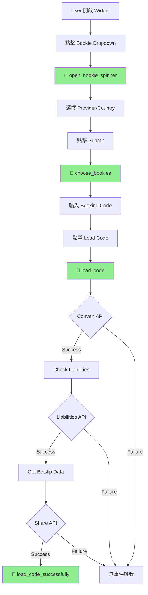

# Phase 1 - Code2Code Sequence Diagram (With GA Events)

> **版本**：3 - 含 GA 事件追蹤  
> **來源**：PRD (2025-01-06 版本) + API Doc  
> **範圍**：Phase 1 - Competitor Code → Fcom Booking Code  
> **更新**：2025-01-06 - 修正轉換成功後的完整流程

---

## App 角色拆分說明

| 角色 | 說明 | GA Event 觸發點 |
|------|------|-----------------|
| **Load Code Widget** | 主要輸入元件 | 開啟 Spinner、選擇 Bookie、Load Code、成功 |
| **Bookie Selector Sheet** | Bottom Sheet 選擇器 | - |
| **Betslip** | 投注單 | - |

---

## 主流程：Code2Code 轉換

```mermaid
sequenceDiagram
    actor User
    
    box rgb(173, 216, 230) App
        participant Widget as Load Code Widget
        participant Selector as Bookie Selector Sheet
        participant Betslip as Betslip
    end
    
    participant BE as Backend

    %% 1. 初始化階段
    rect rgb(240, 248, 255)
        note over User,Widget: 1. 初始化階段
        User->>Widget: 開啟首頁
        Widget->>User: 顯示 Widget (Default 狀態)
    end

    %% 2. 選擇 Bookie
    rect rgb(255, 250, 240)
        note over User,Selector: 2. 選擇 Bookie
        User->>Widget: 點擊 Bookie Dropdown
        note right of Widget: 🎯 GA: code_converter__open_bookie_spinner<br/>params: {location}
        Widget->>BE: GET /orders/converter/config/providerCountries
        
        alt Config API Success
            BE-->>Widget: {bizCode: 10000, data: [{provider, name, countries}...]}
            Widget->>Selector: 開啟 Bottom Sheet
            
            alt ALL 國家 Provider (如 Fcom)
                User->>Selector: 選擇 Provider
                note over Selector: Country 預設為 ALL，無需選擇
            else 單一國家 Provider (如 Bet9ja)
                User->>Selector: 選擇 Provider
                note over Selector: Country 自動選定，無需選擇
            else 多國家 Provider (如 MSport)
                User->>Selector: 選擇 Provider
                Selector->>User: 顯示 Country 列表
                User->>Selector: 選擇 Country
            end
            
            User->>Selector: 點擊 Submit 按鈕
            Selector-->>Widget: 關閉 Sheet + 回傳 {provider, country}
            note right of Widget: 🎯 GA: code_converter__choose_bookies<br/>params: {bookie, country, location}
            Widget->>User: 更新顯示已選 Provider
        
        else Config API Failure
            BE-->>Widget: error response
            Widget->>User: 顯示 "Config Load Failed" 錯誤 (Stop)
        end
    end

    %% 3. 輸入 Booking Code
    rect rgb(240, 255, 240)
        note over User,Widget: 3. 輸入 Booking Code
        User->>Widget: 點擊輸入框
        Widget->>User: 顯示 Focus 狀態
        User->>Widget: 輸入 Booking Code
        Widget->>User: 顯示 Filled 狀態 (Load 按鈕啟用)
    end

    %% 4. 轉換流程
    rect rgb(255, 245, 238)
        note over User,BE: 4. 轉換流程
        User->>Widget: 點擊 Load 按鈕
        note right of Widget: 🎯 GA: code_converter__load_code<br/>params: {bookie, country, location}
        Widget->>User: 顯示 Loading 狀態
        
        Widget->>BE: POST /orders/converter/code
        note over Widget,BE: Request: {provider, country, bookingCode}
        
        alt Convert API Success
            BE-->>Widget: {bizCode: 10000, data: {shareCode, successCnt, failCnt}}
            note over Widget: 記錄 failCnt 用於後續 Toast 顯示
            
            %% 5. Check Liabilities [既有流程]
            note over Widget,BE: 5. Check Liabilities [既有流程]
            Widget->>BE: GET /bookingCode/[shareCode]/liabilities
            
            alt Liabilities API Success
                BE-->>Widget: {isTrusted: true/false}
                
                %% 6. Get Betslip Data [既有流程]
                note over Widget,BE: 6. Get Betslip Data [既有流程]
                Widget->>BE: GET /orders/share/[shareCode]
                
                alt Share API Success
                    BE-->>Widget: {betslipData: selections}
                    
                    %% 7. 彈出 Betslip 並且顯示轉換結果
                    note over Widget,Betslip: 7. 彈出 Betslip 並且顯示轉換結果
                    note right of Widget: 🎯 GA: code_converter__load_code_successfully<br/>params: {bookie, country, location}
                    Widget->>Betslip: Pop up Betslip (載入 selections)
                    Betslip->>User: 顯示 Betslip
                    
                    opt failCnt > 0 (部分轉換失敗)
                        Betslip->>User: 顯示 Toast "⚠ X selections failed to convert"
                    end
                    
                else Share API Failure
                    BE-->>Widget: error response
                    Widget->>User: 按照 Betslip 既有流程顯示錯誤 UI (Stop)
                end
                
            else Liabilities API Failure
                BE-->>Widget: error response
                Widget->>User: 按照 Betslip 既有流程顯示錯誤 UI (Stop)
            end
            
        else Convert API Error
            BE-->>Widget: error response
            Widget->>User: 顯示 Error 狀態 (Stop)
        end
    end
```



---

## GA Events 定義

| Event 名稱 | 觸發時機 | 參數 | 備註 |
|------------|----------|------|------|
| `code_converter__open_bookie_spinner` | 點擊 Bookie Dropdown | `location` | 追蹤入口來源 |
| `code_converter__choose_bookies` | 點擊 Submit 完成選擇後 | `bookie`, `country`, `location` | 追蹤選擇偏好 |
| `code_converter__load_code` | 點擊 Load Code 按鈕 | `bookie`, `country`, `location` | 追蹤轉換嘗試 |
| `code_converter__load_code_successfully` | 全部 API 成功，Betslip 彈出時 | `bookie`, `country`, `location` | SUCCESS 和 PARTIAL 都觸發 |

---

## GA 參數說明

### location 參數

Phase 1 有 **3 個入口**，使用 `location` 參數區分：

| Value | 說明 | 入口位置 |
|-------|------|----------|
| `widget` | 首頁 Widget | 首頁 Load Code Widget |
| `empty_betslip` | 空的 Betslip | Betslip 空狀態引導 |
| `code_center` | Code Center | Code Center 頁籤 |

### bookie 參數

| Value | 說明 |
|-------|------|
| `fcom` | Fcom (Football.com) |
| `sporty` | Sporty |
| `bet9ja` | Bet9ja |
| `betking` | BetKing |
| `msport` | MSport |

### country 參數

| Value | 說明 |
|-------|------|
| `ALL` | 所有國家 |
| `NG` | Nigeria |
| `KE` | Kenya |
| `UG` | Uganda |
| `GH` | Ghana |
| `ZM` | Zambia |
| `TZ` | Tanzania |

---

## GA 事件觸發流程圖



---

## 漏斗分析

追蹤以下轉換漏斗：

```
open_bookie_spinner → choose_bookies → load_code → load_code_successfully
```

### 漏斗計算

| 階段 | 計算方式 |
|------|----------|
| 開啟率 | `open_bookie_spinner` / 頁面曝光 |
| 選擇率 | `choose_bookies` / `open_bookie_spinner` |
| 嘗試率 | `load_code` / `choose_bookies` |
| 成功率 | `load_code_successfully` / `load_code` |

---

## API 調用順序

| 順序 | API | GA Event | 失敗處理 |
|:----:|-----|----------|----------|
| 1 | `GET /orders/converter/config/providerCountries` | `open_bookie_spinner` | Config Load Failed |
| 2 | `POST /orders/converter/code` | `load_code` | Error 狀態 |
| 3 | `GET /bookingCode/[shareCode]/liabilities` | - | Betslip 既有錯誤 UI |
| 4 | `GET /orders/share/[shareCode]` | - | Betslip 既有錯誤 UI |
| 5 | Pop up Betslip | `load_code_successfully` | - |

---

## Response 使用方式

### POST /orders/converter/code

| 條件 | 狀態 | GA Event | App 處理 |
|------|------|----------|----------|
| API Success + 後續 API 都成功 + `failCnt == 0` | SUCCESS | ✅ `load_code_successfully` | 開啟 Betslip |
| API Success + 後續 API 都成功 + `failCnt > 0` | PARTIAL | ✅ `load_code_successfully` | Betslip + Toast |
| API Failure | FAILED | ❌ 無事件 | Error 狀態 |
| 後續 API Failure | FAILED | ❌ 無事件 | Betslip 既有錯誤 UI |

---

## 備註

- 📍 **PRD 來源**：`../01_PRD/01_06/Fcom_PRD_Booking_Code_Converter_01_06_zh-TW.md`
- 📍 **API 文件**：`../API_Doc/Code_Converter_API_Doc.md`
