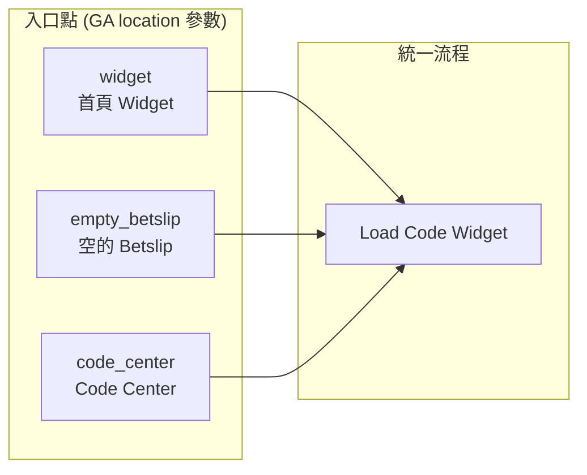

# Phase 1 - Code2Code Sequence Diagram (Complete)

> **版本**：4 - 完整版（Business Logic + API + Figma + GA）  
> **來源**：PRD (2025-01-06 版本) + API Doc + Figma 設計稿  
> **範圍**：Phase 1 - Competitor Code → Fcom Booking Code  
> **更新**：2025-01-06 - 修正轉換成功後的完整流程

---

## App 角色拆分說明

| 角色 | 說明 | 拆分依據 |
|------|------|----------|
| **Load Code Widget** | 主要輸入元件，負責 Bookie 選擇、Code 輸入、狀態顯示 | PRD「Load Code Widget」+ Figma 1.0.x 系列 |
| **Bookie Selector Sheet** | Bottom Sheet 選擇器，負責 Provider 和 Country 選擇 | PRD 獨立互動步驟 + Figma 1.0.3 子畫面 |
| **Betslip** | 投注單，負責載入轉換後的 selections | PRD 結果終點 + Figma Success/Partial Frame |

**拆分理由**：
1. **PRD 流程**：明確定義 Widget → Bottom Sheet → Betslip 的互動流程
2. **Figma 設計**：各元件有獨立的 Frame 和狀態設計
3. **功能職責**：Single Responsibility Principle

---

## 主流程：Code2Code 轉換

```mermaid
sequenceDiagram
    actor User
    
    box rgb(173, 216, 230) App
        participant Widget as Load Code Widget
        participant Selector as Bookie Selector Sheet
        participant Betslip as Betslip
    end
    
    participant BE as Backend

    %% 1. 初始化階段
    rect rgb(240, 248, 255)
        note over User,Widget: 1. 初始化階段
        note over Widget: 📐 Figma: 1.0.0 Default
        User->>Widget: 開啟首頁
        Widget->>User: 顯示 Widget (Default 狀態)
    end

    %% 2. 選擇 Bookie
    rect rgb(255, 250, 240)
        note over User,Selector: 2. 選擇 Bookie
        note over Selector: 📐 Figma: 1.0.3 開啟選單
        User->>Widget: 點擊 Bookie Dropdown
        note right of Widget: 🎯 GA: code_converter__open_bookie_spinner<br/>params: {location}
        
        Widget->>BE: GET /orders/converter/config/providerCountries
        
        alt Config API Success
            BE-->>Widget: {bizCode: 10000, data: [{provider, name, countries}...]}
            Widget->>Selector: 開啟 Bottom Sheet
            
            alt ALL 國家 Provider (如 Fcom)
                note over Selector: 📐 Figma: 1.0.3 (node: 26921:96820)
                User->>Selector: 選擇 Provider
                note over Selector: Country 預設為 ALL，無需選擇
            else 單一國家 Provider (如 Bet9ja)
                note over Selector: 📐 Figma: 1.0.3 單一國家 Bookie
                User->>Selector: 選擇 Provider
                note over Selector: Country 自動選定，無需選擇
            else 多國家 Provider (如 MSport)
                note over Selector: 📐 Figma: 1.0.3 多國家 Bookie
                User->>Selector: 選擇 Provider
                Selector->>User: 顯示 Country 列表
                note over Selector: 📐 Figma: 1.0.3 選擇 Country
                User->>Selector: 選擇 Country
            end
            
            note over Selector: 📐 Figma: 1.0.3 (node: 26921:96820)
            User->>Selector: 點擊 Submit 按鈕
            note over Selector: 📐 Figma: 1.0.3 結果-最終狀態
            Selector-->>Widget: 關閉 Sheet + 回傳 {provider, country}
            note right of Widget: 🎯 GA: code_converter__choose_bookies<br/>params: {bookie, country, location}
            Widget->>User: 更新顯示已選 Provider
        
        else Config API Failure
            BE-->>Widget: error response
            Widget->>User: 顯示 "Config Load Failed" 錯誤 (Stop)
        end
    end

    %% 3. 輸入 Booking Code
    rect rgb(240, 255, 240)
        note over User,Widget: 3. 輸入 Booking Code
        note over Widget: 📐 Figma: 1.0.1 Focus
        User->>Widget: 點擊輸入框
        Widget->>User: 顯示 Focus 狀態 (綠色邊框)
        note over Widget: 📐 Figma: 1.0.2 Typing
        User->>Widget: 輸入 Booking Code
        note over Widget: 📐 Figma: 1.0.4 Filled
        Widget->>User: 顯示 Filled 狀態 (Load 按鈕啟用)
    end

    %% 4. 轉換流程
    rect rgb(255, 245, 238)
        note over User,BE: 4. 轉換流程
        User->>Widget: 點擊 Load 按鈕
        note right of Widget: 🎯 GA: code_converter__load_code<br/>params: {bookie, country, location}
        note over Widget: 📐 Figma: 1.0.5 Loading
        Widget->>User: 顯示 Loading 狀態
        note right of Widget: "Conversion may take up to 10 seconds..."
        
        Widget->>BE: POST /orders/converter/code
        note over Widget,BE: Headers: {uid, OperId}<br/>Request: {provider, country, bookingCode}
        
        alt Convert API Success
            BE-->>Widget: {bizCode: 10000, data: {shareCode, successCnt, failCnt}}
            note over Widget: 記錄 failCnt 用於後續 Toast 顯示
            
            %% 5. Check Liabilities [既有流程]
            note over Widget,BE: 5. Check Liabilities [既有流程]
            Widget->>BE: GET /bookingCode/[shareCode]/liabilities
            
            alt Liabilities API Success
                BE-->>Widget: {isTrusted: true/false}
                
                %% 6. Get Betslip Data [既有流程]
                note over Widget,BE: 6. Get Betslip Data [既有流程]
                Widget->>BE: GET /orders/share/[shareCode]
                
                alt Share API Success
                    BE-->>Widget: {betslipData: selections}
                    
                    %% 7. 彈出 Betslip 並且顯示轉換結果
                    note over Widget,Betslip: 7. 彈出 Betslip 並且顯示轉換結果
                    note right of Widget: 🎯 GA: code_converter__load_code_successfully<br/>params: {bookie, country, location}
                    note over Widget: 📐 Figma: 1.0.8 Success
                    Widget->>Betslip: Pop up Betslip (載入 selections)
                    note over Betslip: 📐 Figma: Betslip Success
                    Betslip->>User: 顯示 Betslip
                    
                    opt failCnt > 0 (部分轉換失敗)
                        note over Betslip: 📐 Figma: Betslip Partial
                        Betslip->>User: 顯示 Toast "⚠ X selections failed to convert"
                    end
                    
                else Share API Failure
                    BE-->>Widget: error response
                    Widget->>User: 按照 Betslip 既有流程顯示錯誤 UI (Stop)
                end
                
            else Liabilities API Failure
                BE-->>Widget: error response
                Widget->>User: 按照 Betslip 既有流程顯示錯誤 UI (Stop)
            end
            
        else Convert API Error
            note over Widget: 📐 Figma: 1.0.6 Error
            BE-->>Widget: error response
            Widget->>User: 顯示 Error 狀態 (Stop)
        end
    end
```



---

## 入口點說明



---

## Figma Frame 對應表

| 流程階段 | Figma Frame | Node ID | Widget 狀態 |
|----------|-------------|---------|-------------|
| 初始化 | 1.0.0 | `26453:93262` | Default |
| 輸入框聚焦 | 1.0.1 | - | Focus |
| 正在輸入 | 1.0.2 | - | Typing |
| 選擇 Bookie | 1.0.3 | `26753:64425` | Focus + Bottom Sheet |
| 輸入完成 | 1.0.4 | `26453:93265` | Filled |
| 轉換中 | 1.0.5 | - | Loading |
| 轉換失敗 | 1.0.6 | - | Error |
| 轉換成功 | 1.0.8 | `26453:93267` | → Betslip |

### Bookie Selector Sheet (1.0.3 子畫面)

| 狀態 | Node ID | 說明 |
|------|---------|------|
| 開啟選單 | `26753:64425` | Bottom Sheet 初始狀態 |
| 單一國家 Bookie | `26753:64562` | 如 Bet9ja (NG only) |
| 多國家 Bookie | `26753:64699` | 如 Bangbet |
| 選擇 Country | `26753:64836` | Country 子選單 |
| **Submit 按鈕** | `26921:96820` | 點擊後關閉 Sheet 並更新 Widget |
| 結果 - 最終狀態 | `26753:85011` | 選擇完成 |

### Provider 類型對照表

| 類型 | 範例 | `countries` 值 | Country 選擇行為 |
|------|------|----------------|------------------|
| **ALL 國家** | Fcom | `["ALL"]` | 預設為 ALL，無需選擇 |
| **單一國家** | Bet9ja | `["NG"]` | 自動選定，無需選擇 |
| **多國家** | MSport | `["NG", "GH", "UG", "ZM"]` | 需要選擇 Country |

### Betslip 結果狀態

| 狀態 | Node ID | 說明 |
|------|---------|------|
| Success | `26428:71768` | failCnt == 0 |
| Partial | `26428:71769` | failCnt > 0，顯示 Toast |

---

## GA Events 定義

| Event 名稱 | 觸發時機 | 參數 |
|------------|----------|------|
| `code_converter__open_bookie_spinner` | 點擊 Bookie Dropdown | `location` |
| `code_converter__choose_bookies` | 點擊 Submit 完成選擇後 | `bookie`, `country`, `location` |
| `code_converter__load_code` | 點擊 Load Code 按鈕 | `bookie`, `country`, `location` |
| `code_converter__load_code_successfully` | 全部 API 成功，Betslip 彈出時 | `bookie`, `country`, `location` |

### 漏斗分析

```
open_bookie_spinner → choose_bookies → load_code → load_code_successfully
```

---

## API 調用順序

| 順序 | API | Method | Figma 狀態 | 失敗處理 |
|:----:|-----|--------|------------|----------|
| 1 | `/orders/converter/config/providerCountries` | `GET` | 1.0.3 | Config Load Failed |
| 2 | `/orders/converter/code` | `POST` | 1.0.5 Loading | 1.0.6 Error |
| 3 | `/bookingCode/[shareCode]/liabilities` | `GET` | [既有流程] | Betslip 既有錯誤 UI |
| 4 | `/orders/share/[shareCode]` | `GET` | [既有流程] | Betslip 既有錯誤 UI |

---

## API 規格

> 📄 完整文件：[Code_Converter_API_Doc.md](../API_Doc/Code_Converter_API_Doc.md)

### 1. Get Provider Country Config

| 項目 | 說明 |
|------|------|
| **Method** | `GET` |
| **Endpoint** | `/orders/converter/config/providerCountries` |

**Response：**

```json
{
  "bizCode": 10000,
  "message": "SUCCESS",
  "data": [
    { "provider": "fcom", "name": "F.com", "countries": ["ALL"] },
    { "provider": "bet9ja", "name": "Bet9ja", "countries": ["NG"] },
    { "provider": "msport", "name": "MSport", "countries": ["NG", "GH", "UG", "ZM"] }
  ]
}
```

**Country 選擇邏輯**：
- `countries == ["ALL"]` → Country 預設為 ALL，無需選擇
- `countries.length == 1` → 自動選定國家，無需選擇
- `countries.length > 1` → 顯示 Country 子選單供選擇

### 2. Convert Code2Code

| 項目 | 說明 |
|------|------|
| **Method** | `POST` |
| **Endpoint** | `/orders/converter/code` |

**Request：**

```json
{
  "provider": "bet9ja",
  "country": "NG",
  "bookingCode": "3RA3FA"
}
```

**Response：**

```json
{
  "bizCode": 10000,
  "message": "SUCCESS",
  "data": {
    "shareCode": "ABC123",
    "successCnt": 5,
    "failCnt": 1
  }
}
```

### 3. Check Liabilities [既有流程]

| 項目 | 說明 |
|------|------|
| **Method** | `GET` |
| **Endpoint** | `/bookingCode/[shareCode]/liabilities` |

### 4. Get Betslip Data [既有流程]

| 項目 | 說明 |
|------|------|
| **Method** | `GET` |
| **Endpoint** | `/orders/share/[shareCode]` |

---

## 狀態對照表

| 條件 | 狀態 | Figma | GA Event | App 處理 |
|------|------|-------|----------|----------|
| 全部 API Success + `failCnt == 0` | SUCCESS | 1.0.8 + Betslip Success | ✅ `load_code_successfully` | 開啟 Betslip |
| 全部 API Success + `failCnt > 0` | PARTIAL | 1.0.8 + Betslip Partial | ✅ `load_code_successfully` | Betslip + Toast |
| Convert API Error | FAILED | 1.0.6 Error | ❌ 無事件 | Error 狀態 |
| Liabilities/Share API Error | FAILED | - | ❌ 無事件 | Betslip 既有錯誤 UI |

---

## TODO 確認清單

| # | 問題 | 確認對象 | 狀態 |
|---|------|----------|------|
| 1 | Timeout 時間設定 | BE | ⏳ |
| 2 | 失敗選項詳細資訊如何取得 | BE | ⏳ |
| 3 | 成功後是自動跳轉 Betslip 還是顯示 CTA | PM | ⏳ |
| 4 | PARTIAL 狀態可否繼續投注 | PM | ⏳ |

---

## 相關文件

| 類型 | 路徑 |
|------|------|
| **PRD** | `../01_PRD/01_06/Fcom_PRD_Booking_Code_Converter_01_06_zh-TW.md` |
| **Figma Nodes** | `../02_Design/Figma_Nodes_Phase1.md` |
| **設計規格** | `../02_Design/Phase1_Design_Specs.md` |
| **API 文件** | `../API_Doc/Code_Converter_API_Doc.md` |
| **Submit 按鈕 Figma** | [node 26921:96820](https://www.figma.com/design/SvcTlADMZ7gUPIa7nN2hT1/Code-Converter?node-id=26921-96820&m=dev) |

---

## 其他版本

| 版本 | 說明 | 檔案 |
|------|------|------|
| 1 - Basic | Business Logic + API + App State | `Phase1_Sequence_Diagram_1_Basic.md` |
| 2 - Figma | Basic + Figma 資訊 | `Phase1_Sequence_Diagram_2_Figma.md` |
| 3 - GA | Basic + GA Events | `Phase1_Sequence_Diagram_3_GA.md` |
| **4 - Complete** | 完整版 | 本文件 |
