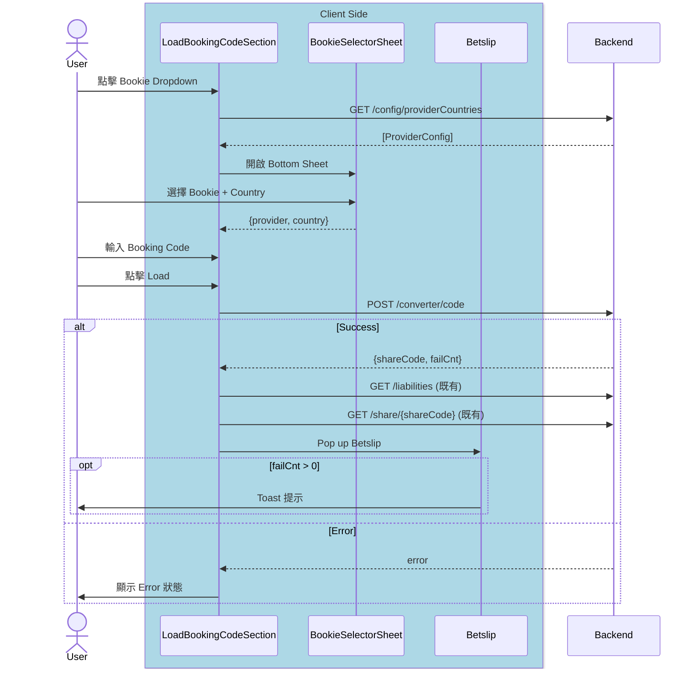

# Code Converter - iOS System Design

> **目標對象**：iOS Team  
> **分享時長**：30-45 分鐘  
> **目的**：讓團隊了解功能設計、架構決策、實作細節

---

## 📋 大綱

### 1. 功能概述 (5 min)

💬
> 「先講一下這個功能是什麼、為什麼要做、會出現在哪裡。」

#### What - Code Converter 是什麼？

💬
> 「簡單說，就是讓用戶把**競品的 Booking Code** 轉成我們的。」
> 「比如用戶在 Bet9ja 有一張投注單，他可以把那個 code 貼過來，我們轉成 Fcom 的 code，直接載入 Betslip。」

- 將競爭對手的 Booking Code 轉換為 Fcom Booking Code
- Phase 1: **Code2Code**（手動輸入）
- 後續 Phase 2/3 會支援 OCR 掃描、語音輸入等

#### Why - 業務價值

💬
> 「為什麼要做這個？兩個原因：」

| 價值 | 說明 |
|------|------|
| **降低用戶遷移成本** | 用戶不用重新選比賽、選賠率，直接轉換 |
| **提升 conversion rate** | 減少操作步驟 = 更高完成率 |

#### Where - 入口點

💬
> 「這個功能會出現在 3 個地方，都是用同一個 View：`LoadBookingCodeSectionView`。」

| 入口點 | 說明 |
|--------|------|
| 首頁 Widget | 現有的 Load Code 區塊，原地擴展 |
| Code Center Load Code Tab | 替換原有的 UIKit ViewController |
| Betslip Empty State | 空 Betslip 時顯示，引導用戶載入 |

---

### 2. 核心流程 (5 min)

> 🎯 **重點**：讓團隊理解 happy path 和 error handling

```
User → 選擇 Bookie → 輸入 Code → 點擊 Load → 轉換 → Betslip
```

**關鍵 API 順序：**
1. `GET /orders/converter/config/providerCountries` - 取得 Provider 列表
2. `POST /orders/converter/code` - Code2Code 轉換
3. `GET /bookingCode/{shareCode}/liabilities` - Liabilities (既有)
4. `GET /orders/share/{shareCode}` - Betslip Data (既有)

#### 簡化版 Sequence Diagram



---

### 3. 架構設計 (10 min) ⭐ 核心

> 🎯 **重點**：Clean Architecture + TCA 的應用

```
┌─────────────────────────────────────────────────────────┐
│  UI Layer (SwiftUI)                                     │
│  ├── LoadBookingCodeSectionView (擴展)                          │
│  ├── BookieDropdownView (擴展)                          │
│  └── BookieSelectorSheet (新增)                         │
├─────────────────────────────────────────────────────────┤
│  Domain Layer (TCA)                                     │
│  ├── Feature: LoadBookingCodeSection.Feature (擴展)             │
│  ├── UseCase: LoadProviderConfigUseCase (新增)          │
│  └── UseCase: ConvertBookingCodeUseCase (新增)          │
├─────────────────────────────────────────────────────────┤
│  Domain Model                                           │
│  ├── ProviderConfig                                     │
│  ├── SelectedBookie                                     │
│  ├── ConvertResult                                      │
│  └── WidgetInputState (enum: 6 種狀態)                  │
├─────────────────────────────────────────────────────────┤
│  Data Layer                                             │
│  ├── CodeConverterRepository (新增)                     │
│  ├── CodeConverterClient (新增)                         │
│  └── CodeConverterAPI (新增)                            │
└─────────────────────────────────────────────────────────┘
```

**Q1: 為什麼選擇「擴展」而非「重寫」？**

| 考量 | 擴展 ✅ | 重寫 ❌ |
|------|---------|---------|
| **風險** | 低 - 既有邏輯不變 | 高 - 可能破壞既有流程 |
| **時程** | 短 - 只加新功能 | 長 - 需重新測試全部 |
| **Code Review** | 差異小，容易審查 | 差異大，難以審查 |

---

**Q2: UseCase 如何封裝 business logic？**

UseCase 負責**編排多個 Repository 調用**，將複雜的 API 串接邏輯封裝成單一入口：

```swift
struct ConvertBookingCodeUseCase {
    let codeConverterRepository: CodeConverterRepositoryProtocol
    let betslipRepository: BetslipRepositoryProtocol
    
    func execute(_ input: ConvertBookingCodeInput) async -> Result<Output, Error> {
        // 1. 轉換 Booking Code (新 API)
        let convertResult = try await codeConverterRepository.convertCode(...)
        
        // 2. 檢查 Liabilities (既有 API)
        _ = try await betslipRepository.checkLiabilities(shareCode: convertResult.shareCode)
        
        // 3. 取得 Betslip Data (既有 API)
        let betslipData = try await betslipRepository.getBetslipData(shareCode: convertResult.shareCode)
        
        return .success(Output(convertResult: convertResult, betslipData: betslipData))
    }
}
```

**好處：**
- Reducer 保持 thin（只處理 state mutation）
- Business logic 可獨立 unit test
- 複用既有 `BetslipRepository`

---

**補充：Reducer 保持 thin 是什麼意思？**

| 層級 | 職責 | 範例 |
|------|------|------|
| **Reducer** | State mutation + 發起 Effect | `state.isLoading = true` → `return .run { await useCase.execute() }` |
| **UseCase** | Business logic + 編排 API | 串接 3 個 API、錯誤轉換、資料組裝 |
| **Repository** | 資料存取 | HTTP request、cache、DTO → Domain mapping |

```swift
// ❌ Fat Reducer（不推薦）
case .loadBookingCode:
    state.isLoading = true
    return .run { send in
        // 😱 Business logic 全部塞在 Reducer
        let convertResult = try await httpClient.post("/converter/code", ...)
        let liabilities = try await httpClient.get("/liabilities/\(convertResult.shareCode)")
        let betslip = try await httpClient.get("/share/\(convertResult.shareCode)")
        // 錯誤處理、資料轉換...
        await send(.completed(betslip))
    }

// ✅ Thin Reducer（推薦）
case .loadBookingCode:
    state.isLoading = true
    return .run { send in
        // 👍 只調用 UseCase，邏輯封裝在 UseCase 內
        let result = await convertBookingCodeUseCase.execute(input)
        await send(.convertCodeCompleted(result))
    }

case .convertCodeCompleted(.success(let output)):
    // 👍 Reducer 只負責 state mutation
    state.isLoading = false
    state.convertResult = output.convertResult
    return .send(.presentBetslip(shareCode: output.shareCode))
```

**為什麼要 thin？**
1. **可測試性**：UseCase 可以獨立 unit test，不需要 TCA TestStore
2. **可讀性**：Reducer 一眼看出 state 如何變化
3. **可複用**：同一個 UseCase 可被多個 Feature 使用
4. **關注點分離**：Reducer = What state changes，UseCase = How to get data

---

### 4. 復用策略 (5 min) ⭐ 設計決策

> 🎯 **重點**：最大化復用，最小化改動

| 現有元件 | 擴展為 | 變更類型 |
|----------|--------|----------|
| `LoadBookingCodeSectionView` | `LoadBookingCodeSectionView` | 擴展 |
| `CountryDropdownView` | `BookieDropdownView` | 擴展 |
| `LoadBookingCodeSection.Feature` | `LoadBookingCodeSection.Feature` | 擴展 |

---

### 5. TCA Feature 設計 (10 min) ⭐ 核心

> 🎯 **重點**：State/Action/Reducer 的設計思路

💬
> 「接下來看 TCA Feature 的設計。我會分成 State、Action、Reducer 三個部分講，重點是讓大家了解新增了哪些東西、為什麼這樣設計。」

---

#### State 新增屬性

💬
> 「State 我們保留原有的 `bookingCode`、`selectedCountry`，新增三個關鍵屬性：」
> - `selectedBookie` → 「用來存用戶選的 Bookie + Country」
> - `providerConfigs` → 「從 API 拿到的 Provider 列表，用來渲染 Bottom Sheet」
> - `inputState` → 「這是一個 enum，代表輸入框的 6 種狀態，等下會細講」

```swift
// 原有
var bookingCode: String = ""
var selectedCountry: Region = .current

// 新增
var selectedBookie: SelectedBookie?
var providerConfigs: [ProviderConfig] = []
var inputState: WidgetInputState = .default  // 6 種狀態
```

---

#### Action 分類

💬
> 「Action 我分成三類來看：」
> - **UI Actions** → 「用戶操作觸發的，像是點擊 dropdown、輸入文字」
> - **Response Actions** → 「API 回來後觸發的，帶著成功或失敗的結果」
> - **Navigation Actions** → 「需要跳頁的，這邊只有一個 `presentBetslip`」
>
> 「注意看『原有/新增』欄位，這樣團隊可以快速知道哪些是要新寫的。」

| 類型 | Actions | 原有/新增 | 說明 |
|------|---------|-----------|------|
| UI | `onAppear`, `bookingCodeChanged`, `loadBookingCode` | ✅ 原有 | 既有用戶互動 |
| UI | `bookieDropdownTapped`, `inputFocused`, `clearButtonTapped` | 🆕 新增 | Code Converter 用戶互動 |
| Response | `bookingCodeLoaded`, `bookingCodeLoadFailed` | ✅ 原有 | 既有 API 回應 |
| Response | `providerConfigLoaded`, `convertCodeCompleted` | 🆕 新增 | Code Converter API 回應 |
| Navigation | `presentBetslip(shareCode:, failCnt:)` | 🆕 新增 | Betslip 導航 |

---

#### Reducer 重點邏輯

💬
> 「Reducer 的重點邏輯有三個：」
> - `loadBookingCode` → 「這是原有的 Action，但邏輯改成調用 UseCase」
> - `bookieSelected` → 「用戶選完 Bookie 後，更新 state 並關閉 Sheet」
> - `convertCodeCompleted` → 「API 回來後，成功就導航到 Betslip，失敗就顯示 Error 狀態」

| Action | 原有/新增 | 邏輯說明 |
|--------|-----------|----------|
| `loadBookingCode` | ✅ 原有（擴展） | 調用 ConvertBookingCodeUseCase 執行轉換 |
| `bookieSelected` | 🆕 新增 | 更新 selectedBookie |
| `convertCodeCompleted` | 🆕 新增 | 處理轉換成功/失敗 + 狀態轉換 |

💬
> 「整體設計思路是：Reducer 保持 thin，只做 state mutation 和發起 Effect，business logic 都封裝在 UseCase 裡面。」

---

### 6. UI 狀態機 (5 min)

> 🎯 **重點**：6 種輸入狀態如何映射到 UI

| 狀態 | 輸入框邊框 | 清除按鈕 | Load 按鈕 |
|------|-----------|----------|-----------|
| Default | 無 | 隱藏 | 禁用 |
| Focus | 綠色 | 隱藏 | 禁用 |
| Typing | 綠色 | ⊗ | 啟用 |
| Filled | 無 | ⊗ | 啟用 |
| Loading | 無 | 隱藏 | Spinner |
| Error | 紅色 | ⊗ | 啟用 |

```swift
enum WidgetInputState: Equatable {
    case `default`
    case focus
    case typing
    case filled
    case loading
    case error(message: String)
}
```

---

## 📎 相關文件連結

| 文件 | 說明 |
|------|------|
| TDD Overview | `TDD/00_Overview/01_overview.md` |
| Sequence Diagram | `Docs/03_Development/Phase1_Sequence_Diagram_*.md` |
| TCA Feature | `TDD/06_Feature State and Action (TCA)/01_feature_state_action.md` |
| API Spec | `TDD/08_API Spec and Mapping/01_api_spec.md` |
| Test Scenarios | `TDD/10_Test Scenarios/01_test_scenarios.md` |

---

## ⏱ 時間分配建議

| 區塊 | 時間 | 重要性 |
|------|------|--------|
| 功能概述 | 5 min | ⭐⭐ |
| 核心流程 | 5 min | ⭐⭐⭐ |
| 架構設計 | 10 min | ⭐⭐⭐⭐⭐ |
| 復用策略 | 5 min | ⭐⭐⭐⭐ |
| TCA Feature | 10 min | ⭐⭐⭐⭐⭐ |
| UI 狀態機 | 5 min | ⭐⭐⭐ |
| **Q&A** | 10 min | - |

