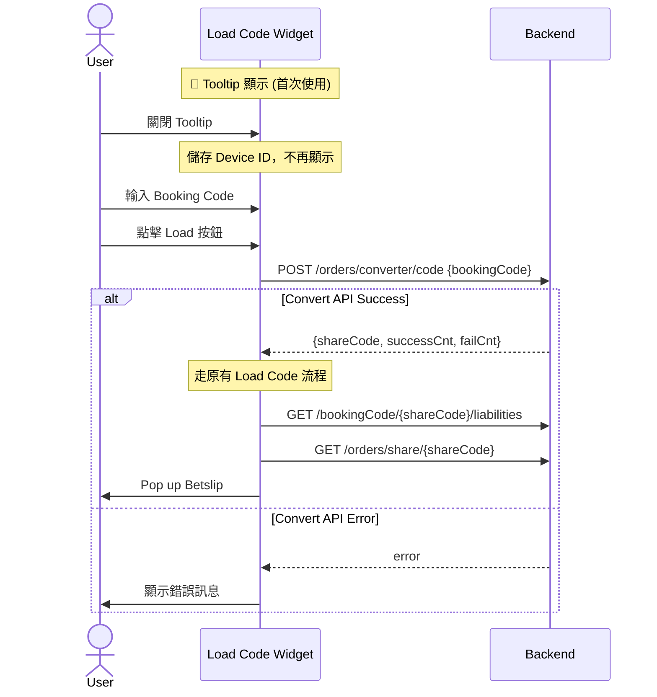

# Code Converter Phase 1 - TDD Overview

## 功能概述

**Code Converter** 是一個讓用戶將其他博彩公司（Bookie）的 Booking Code 轉換為 Fcom Booking Code 的功能。Phase 1 實作 **Code2Code** 轉換，支援用戶手動輸入競爭對手的 Booking Code 並轉換。

---

## ⚠️ BE 新設計更新 (2025-01)

| 變更項目 | 舊版 | 新版 |
|----------|------|------|
| **Provider/Country 選擇** | 需先選擇 Bookie (Provider + Country) | ❌ **廢棄** - 不需選擇 |
| **Config API** | `GET /orders/converter/config/providerCountries` | ❌ **廢棄** |
| **Convert API** | `POST /orders/converter/code` (含 provider, country) | `POST /orders/converter/code` (只需 bookingCode) |
| **Bookie Selector Sheet** | 需要實作 | ❌ **廢棄** - 不需實作 |
| **流程** | 選 Bookie → 輸入 Code → 轉換 | 輸入 Code → 轉換 → 走原有 load code 流程 |

---

## 核心需求

| 需求 | 說明 |
|------|------|
| 輸入 | 用戶輸入任意 Booking Code（無需選擇 Provider） |
| 轉換 | 調用後端 API 進行 Code2Code 轉換 |
| 輸出 | 生成 Fcom ShareCode，走原有 load code 流程導航至 Betslip |
| 錯誤處理 | Code Not Found、Partial Failure、All Failed |
| **Tooltip** | 首次使用時顯示引導 Tooltip |

---

## Tooltip 功能

### 行為描述

| 項目 | 說明 |
|------|------|
| **顯示時機** | 功能上線後，所有 Load Code Widget 出現處 |
| **顯示位置** | 首頁 Widget、Code Center、Betslip Empty 等 |
| **消失條件** | User 第一次在任意地方點擊關閉 Tooltip |
| **儲存機制** | 以 Device ID 判斷是否再次出現 |
| **跨入口同步** | 任一入口關閉後，所有入口皆不再顯示 |

### Tooltip UI (參考 Figma 1.0.0)

```
┌────────────────────────────────────────────────────┐
│ 💡 Insert a booking code from any provider  ✕     │
└────────────────────────────────────────────────────┘
```

---

## 入口點

| 位置 | 現有實作 | 替換為 |
|------|----------|--------|
| **首頁 Widget** | `LoadBookingCodeSectionView` | `LoadCodeWidgetView`（原地擴展） |
| **Code Center Load Code Tab** | `LoadCodeViewWrapper` → `LoadCodeViewController` (UIKit) | `LoadCodeWidgetView` (SwiftUI) |
| **首頁 Betslip (Empty)** | 既有空狀態 | 嵌入 `LoadCodeWidgetView` |

---

## 復用策略（核心設計決策）

### 最大化復用 LoadBookingCodeSectionView

```
┌─────────────────────────────────────────────────────────────────────┐
│                    復用策略                                          │
├─────────────────────────────────────────────────────────────────────┤
│  ✅ 擴展現有 View/Feature 結構                                       │
│  ✅ 保持原有 API 向後相容                                            │
│  ✅ 新功能以 optional flag (enableCodeConverter) 控制                │
│  ✅ 子元件擴展而非重寫                                               │
│  ✅ 漸進式替換 LoadCodeViewController                                │
└─────────────────────────────────────────────────────────────────────┘
```

### 元件對照表

| 現有元件 | 擴展為 | 變更類型 |
|----------|--------|----------|
| `LoadBookingCodeSectionView` | `LoadCodeWidgetView` | 擴展 |
| ~~`CountryDropdownView`~~ | ~~`BookieDropdownView`~~ | ❌ 廢棄 - 不再需要 |
| `BookingCodeInputView` | `BookingCodeInputView` | 擴展（增加狀態） |
| `LoadBookingCodeSection.Feature` | `LoadCodeWidget.Feature` | 擴展 |
| ~~`BookieSelectorSheet`~~ | - | ❌ 廢棄 - 不再需要 |
| - | `TooltipView` | 新增 (SwiftUI) |

---

## UI 狀態對照（6 種狀態）

| 狀態 | 輸入框邊框 | 清除按鈕 | Load 按鈕 | 提示文字 |
|------|-----------|----------|-----------|----------|
| **Default** | 無 | 隱藏 | 灰色禁用 | 無 |
| **Focus** | 綠色 | 隱藏 | 灰色禁用 | 無 |
| **Typing** | 綠色 | 顯示 ⊗ | 綠色啟用 | 無 |
| **Filled** | 無 | 顯示 ⊗ | 綠色啟用 | 無 |
| **Loading** | 無 | 隱藏 | Spinner | "Conversion may take up to 10 seconds..." |
| **Error** | 紅色 | 顯示 ⊗ | 綠色啟用 | 紅色錯誤訊息 |

---

## 技術架構

### Clean Architecture 分層

```
UI Layer (SwiftUI)
    └── LoadCodeWidgetView, TooltipView
    
Domain Layer (TCA)
    ├── Feature: LoadCodeWidget.Feature
    └── UseCase: ConvertBookingCodeUseCase
    
Domain Model
    └── ConvertResult, WidgetInputState
    
Data & Infrastructure Layer
    ├── Repository: CodeConverterRepository
    ├── Client: CodeConverterClient
    ├── API: CodeConverterAPI
    └── TooltipStorage (UserDefaults + Device ID)
```

### API Endpoints

| API | 用途 | 狀態 |
|-----|------|------|
| ~~`GET /orders/converter/config/providerCountries`~~ | ~~取得 Provider Config~~ | ❌ 廢棄 |
| `POST /orders/converter/code` | Code2Code 轉換 (只需 bookingCode) | ✅ 使用中 |
| `GET /bookingCode/{shareCode}/liabilities` | Liabilities 檢查（既有流程） | ✅ 使用中 |
| `GET /orders/share/{shareCode}` | 取得 Betslip Data（既有流程） | ✅ 使用中 |

---

## 實作優先級

### Phase 1.1: 擴展現有元件

1. 擴展 `LoadBookingCodeSection.State/Action/Feature`
2. 擴展 `BookingCodeInputView`（增加 6 種狀態）
3. ~~擴展 `CountryDropdownView` → `BookieDropdownView`~~ ❌ 廢棄
4. ~~新增 `BookieSelectorSheet` (SwiftUI)~~ ❌ 廢棄
5. 新增 `TooltipView` (SwiftUI)
6. 實作 Tooltip 儲存邏輯 (Device ID)

### Phase 1.2: 新增 Data Layer

1. 定義 Domain Models
2. 實作 `CodeConverterRepository`
3. 實作 `CodeConverterClient`
4. ~~實作 `LoadProviderConfigUseCase`~~ ❌ 廢棄
5. 實作 `ConvertBookingCodeUseCase`

### Phase 1.3: 替換入口點

1. 首頁 Widget：設置 `enableCodeConverter = true` + Tooltip
2. Code Center：用 `LoadCodeWidgetView` 替換 `LoadCodeViewWrapper` + Tooltip
3. Betslip Empty：嵌入 `LoadCodeWidgetView` + Tooltip

### Phase 1.4: 清理

1. 移除 `LoadCodeViewController`
2. 移除 `LoadCodeViewController.xib`
3. 移除 `LoadCodeViewWrapper`

---

## 測試策略

| 測試類型 | 範圍 | 優先級 |
|----------|------|--------|
| Unit Test | Domain Models, UseCases | P0 |
| TCA TestStore | Feature State/Action | P0 |
| Integration Test | API Client | P1 |
| UI Test | 關鍵用戶流程 | P1 |

---

## 風險與待確認

| 風險 | 影響 | 緩解措施 |
|------|------|----------|
| 原有邏輯相容性 | LoadCodeManager 既有呼叫可能受影響 | 保持 enableCodeConverter = false 時完全相容 |
| API 回傳格式變更 | DTO 映射失敗 | 與後端確認完整 Response 結構 |
| Betslip 導航邏輯 | 部分失敗時的 Betslip 載入 | 確認 shareCode 是否只包含成功的 selections |
| 效能（長時間轉換） | Loading 狀態最長 10 秒 | 顯示提示文字提醒用戶 |
| Tooltip 跨入口同步 | 需確保所有入口都讀取同一份 flag | 使用統一的 TooltipStorage + Device ID |

---

## 簡化後的流程圖


