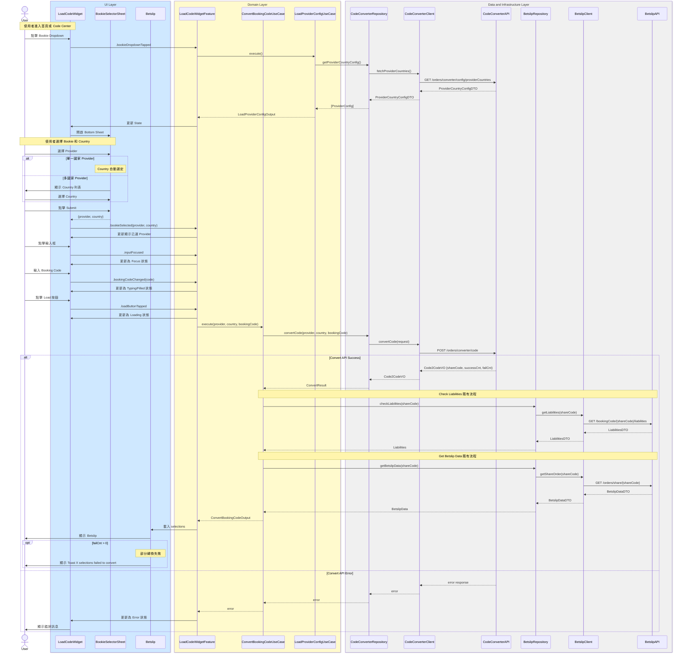

# Code2Code 完整整合流程

## Flow 資訊

| 欄位 | 值 |
|------|-----|
| **feature** | CodeConverter |
| **flow_id** | CC-ISSD-001 |
| **flow_type** | Full |
| **flow_name** | Code2Code 完整整合流程 |

---

## 流程說明

| 階段 | 說明 |
|------|------|
| **1. 初始化階段** | 1. Widget 顯示預設狀態 2. 使用者點擊 Bookie Dropdown 3. 系統取得 Provider Config |
| **2. 選擇 Bookie** | 1. 開啟 Bookie Selector Sheet 2. 選擇 Provider 和 Country 3. 關閉 Sheet 並更新 Widget |
| **3. 輸入 Booking Code** | 1. Focus 輸入框 2. 輸入 Booking Code 3. 啟用 Load 按鈕 |
| **4. 轉換流程** | 1. 呼叫 Convert API 2. 檢查 Liabilities 3. 取得 Betslip Data 4. 載入 Betslip |

---

## 整合序列圖

---

## API 調用順序

| 順序 | API | Method | 說明 |
|:----:|-----|--------|------|
| 1 | `/orders/converter/config/providerCountries` | `GET` | 取得 Provider Country 設定 |
| 2 | `/orders/converter/code` | `POST` | 轉換 Booking Code |
| 3 | `/bookingCode/{shareCode}/liabilities` | `GET` | 檢查 Liabilities（既有） |
| 4 | `/orders/share/{shareCode}` | `GET` | 取得 Betslip Data（既有） |

