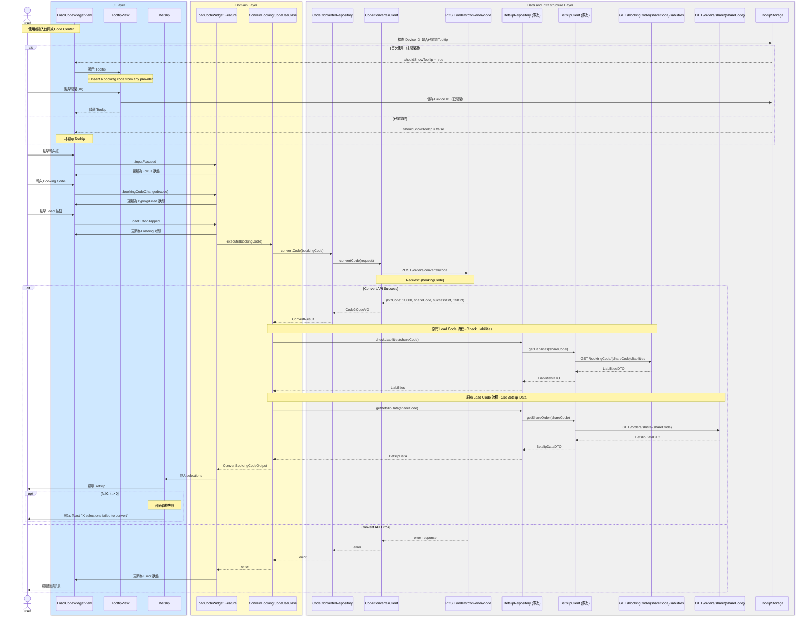

# Code2Code 完整整合流程

## Flow 資訊

| 欄位 | 值 |
|------|-----|
| **feature** | CodeConverter |
| **flow_id** | CC-ISSD-001 |
| **flow_type** | Full |
| **flow_name** | Code2Code 完整整合流程 |

---

## ⚠️ BE 新設計更新 (2025-01)

| 變更項目 | 說明 |
|----------|------|
| **Config API 廢棄** | ~~`GET /orders/converter/config/providerCountries`~~ 不再使用 |
| **Provider/Country 移除** | Convert API 不再需要 provider 和 country 參數 |
| **Bookie Selector 移除** | 不再需要 Bookie 選擇流程 |
| **流程簡化** | 直接輸入 Code → 轉換 → 走原有 load code 流程 |

---

## 流程說明

| 階段 | 說明 |
|------|------|
| **0. Tooltip 顯示** | 首次使用時顯示引導 Tooltip，關閉後以 Device ID 記錄不再顯示 |
| **1. 輸入 Booking Code** | 1. Focus 輸入框<br>2. 輸入任意 Booking Code<br>3. 啟用 Load 按鈕 |
| **2. 轉換流程** | 1. 呼叫 Convert API（只帶 bookingCode）<br>2. 取得 shareCode |
| **3. 原有 Load Code 流程** | 1. 檢查 Liabilities<br>2. 取得 Betslip Data<br>3. 載入 Betslip |

---

## 整合序列圖



---

## API 調用順序

| 順序 | API | Method | 說明 | 狀態 |
|:----:|-----|--------|------|------|
| ~~1~~ | ~~`/orders/converter/config/providerCountries`~~ | ~~`GET`~~ | ~~取得 Provider Country 設定~~ | ❌ 廢棄 |
| 1 | `/orders/converter/code` | `POST` | 轉換 Booking Code (只需 bookingCode) | ✅ |
| 2 | `/bookingCode/{shareCode}/liabilities` | `GET` | 檢查 Liabilities（既有流程） | ✅ |
| 3 | `/orders/share/{shareCode}` | `GET` | 取得 Betslip Data（既有流程） | ✅ |

---

## Tooltip 儲存邏輯

### TooltipStorage

```swift
struct TooltipStorage {
    private let userDefaults: UserDefaults
    private let key = "CodeConverter.TooltipDismissed"
    
    var shouldShowTooltip: Bool {
        !userDefaults.bool(forKey: key)
    }
    
    func dismissTooltip() {
        userDefaults.set(true, forKey: key)
    }
}
```

### Device ID 綁定說明

| 項目 | 說明 |
|------|------|
| **儲存位置** | UserDefaults (App Sandbox) |
| **Key** | `CodeConverter.TooltipDismissed` |
| **Value** | `Bool` (true = 已關閉) |
| **跨裝置** | 不同步（每個 Device 獨立） |
| **重裝 App** | 會重置（首次安裝顯示 Tooltip） |

---

## 廢棄項目清單

| 項目 | 類型 | 原因 |
|------|------|------|
| `GET /orders/converter/config/providerCountries` | API | BE 新設計不再需要 |
| `LoadProviderConfigUseCase` | UseCase | 無需載入 Provider Config |
| `BookieSelectorSheet` | UI | 無需選擇 Bookie |
| `BookieDropdownView` | UI | 無需顯示 Bookie Dropdown |
| `ProviderConfig` | Domain Model | 無需 Provider 設定 |
| `SelectedBookie` | Domain Model | 無需 Bookie 選擇 |
| `.bookieDropdownTapped` | Action | 無需觸發 Bookie Dropdown |
| `.bookieSelected` | Action | 無需處理 Bookie 選擇 |
| `providerConfigs` | State | 無需儲存 Provider 設定 |
| `selectedBookie` | State | 無需儲存已選 Bookie |
| `isBookieSelectorPresented` | State | 無需控制 Sheet 顯示 |
