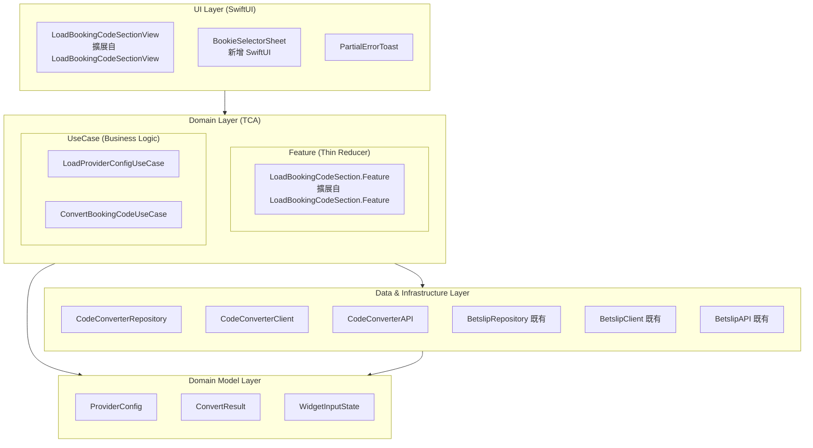

# Clean Architecture 分層圖

## 架構總覽



---

## 復用策略（核心）

### 最大化復用 LoadBookingCodeSectionView

```
┌─────────────────────────────────────────────────────────────────────┐
│                    LoadBookingCodeSectionView（新）                          │
│    ┌──────────────────────────────────────────────────────────────┐ │
│    │  擴展自 LoadBookingCodeSectionView 的結構                      │ │
│    │                                                              │ │
│    │  ┌─────────────────┐  ┌───────────────────────────────────┐  │ │
│    │  │ BookieDropdown  │  │ BookingCodeInput                  │  │ │
│    │  │ (擴展自         │  │ (擴展自 BookingCodeInputView)      │  │ │
│    │  │ CountryDropdown)│  │                                   │  │ │
│    │  │                 │  │ + Error 狀態（紅框）               │  │ │
│    │  │ + Bookie 名稱   │  │ + 清除按鈕 ⊗                      │  │ │
│    │  │ + Country       │  │ + Loading 提示文字                 │  │ │
│    │  │ + 點擊開啟 Sheet│  │ + Load 按鈕狀態                   │  │ │
│    │  └─────────────────┘  └───────────────────────────────────┘  │ │
│    └──────────────────────────────────────────────────────────────┘ │
│                                                                     │
│    ┌──────────────────────────────────────────────────────────────┐ │
│    │  BookieSelectorSheet（新增 SwiftUI）                          │ │
│    │  - Bottom Sheet                                              │ │
│    │  - 雙欄選擇器（Bookie + Country）                             │ │
│    └──────────────────────────────────────────────────────────────┘ │
└─────────────────────────────────────────────────────────────────────┘
```

---

## 入口點與替換計畫

| 入口點 | 現有實作 | 替換為 |
|--------|----------|--------|
| **首頁 Widget** | `LoadBookingCodeSectionView` | `LoadBookingCodeSectionView`（原地擴展） |
| **Code Center Load Code Tab** | `LoadCodeViewWrapper` → `LoadCodeViewController` (UIKit) | `LoadBookingCodeSectionView` (SwiftUI) |
| **首頁 Betslip (Empty)** | 無 / 既有空狀態 | 嵌入 `LoadBookingCodeSectionView` |

---

## 依賴方向

**嚴格遵循單向依賴：**

```
UI → Feature → UseCase → Repository → Client → API
```

---

## 元件變更清單

### 擴展的元件（最小改動）

| 元件 | 變更類型 | 說明 |
|------|----------|------|
| `LoadBookingCodeSectionView` | **擴展** | → `LoadBookingCodeSectionView`，增加更多狀態 |
| `CountryDropdownView` | **擴展** | → `BookieDropdownView`，顯示 Bookie + Country |
| `BookingCodeInputView` | **擴展** | 增加 Error 狀態、清除按鈕、Loading 提示 |
| `LoadBookingCodeSection.Feature` | **擴展** | → `LoadBookingCodeSection.Feature`，增加 Provider Config + Convert API |

### 新增的元件

| 元件 | 類型 | 說明 |
|------|------|------|
| `BookieSelectorSheet` | SwiftUI View | 雙欄選擇器 Bottom Sheet |
| `LoadProviderConfigUseCase` | UseCase | 取得 Provider Config |
| `ConvertBookingCodeUseCase` | UseCase | Code2Code 轉換 |
| `CodeConverterRepository` | Repository | Code Converter 資料存取 |
| `CodeConverterClient` | Client | HTTP 通訊 |

### 廢棄的元件

| 元件 | 原因 |
|------|------|
| `LoadCodeViewController` | 被 `LoadBookingCodeSectionView` (SwiftUI) 替換 |
| `LoadCodeViewController.xib` | 隨 ViewController 一起廢棄 |
| `LoadCodeViewWrapper` | 不再需要 UIKit 橋接 |

---

## 模組分組

```
LoadBookingCodeSection/  (擴展自 LoadBookingCode/)
├── View/
│   ├── LoadBookingCodeSectionView.swift          (擴展自 LoadBookingCodeSectionView)
│   ├── BookieDropdownView.swift          (擴展自 CountryDropdownView)
│   ├── BookingCodeInputView.swift        (擴展，增加狀態)
│   └── BookieSelectorSheet.swift         (新增)
├── Feature/
│   └── LoadBookingCodeSection+Feature.swift      (擴展自 LoadBookingCodeSection+Feature)
├── UseCase/
│   ├── LoadProviderConfigUseCase.swift   (新增)
│   └── ConvertBookingCodeUseCase.swift   (新增)
├── Domain/
│   ├── ProviderConfig.swift              (新增)
│   ├── ConvertResult.swift               (新增)
│   └── WidgetInputState.swift            (新增)
├── Repository/
│   └── CodeConverterRepository.swift     (新增)
├── Client/
│   └── CodeConverterClient.swift         (新增)
└── API/
    └── CodeConverterAPI.swift            (新增)
```
