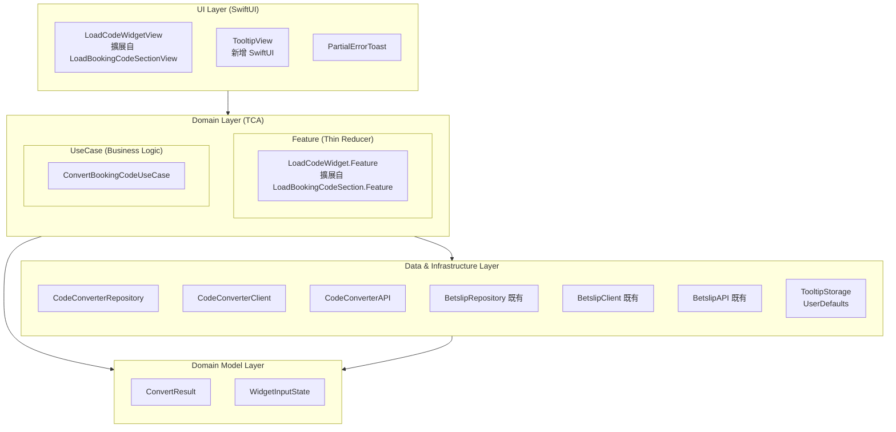

# Clean Architecture 分層圖

## ⚠️ BE 新設計更新 (2025-01-14)

| 變更項目 | 說明 |
|----------|------|
| **BookieSelectorSheet 移除** | 不再需要 Bookie 選擇流程 |
| **LoadProviderConfigUseCase 移除** | Config API 已廢棄 |
| **ProviderConfig 移除** | 不再需要 Provider 設定 |
| **TooltipView 新增** | 一次性說明 Tooltip |
| **TooltipStorage 新增** | Tooltip 狀態儲存 (UserDefaults) |

---

## 架構總覽



---

## 復用策略（核心）

### 最大化復用 LoadBookingCodeSectionView

```
┌─────────────────────────────────────────────────────────────────────┐
│                    LoadCodeWidgetView（簡化版）                       │
│    ┌──────────────────────────────────────────────────────────────┐ │
│    │  擴展自 LoadBookingCodeSectionView 的結構                      │ │
│    │                                                              │ │
│    │  ┌───────────────────────────────────────────────────────┐   │ │
│    │  │ BookingCodeInput                                      │   │ │
│    │  │ (擴展自 BookingCodeInputView)                          │   │ │
│    │  │                                                       │   │ │
│    │  │ + Error 狀態（紅框）                                   │   │ │
│    │  │ + 清除按鈕 ⊗                                          │   │ │
│    │  │ + Loading 提示文字                                     │   │ │
│    │  │ + Load 按鈕狀態                                        │   │ │
│    │  └───────────────────────────────────────────────────────┘   │ │
│    └──────────────────────────────────────────────────────────────┘ │
│                                                                     │
│    ┌──────────────────────────────────────────────────────────────┐ │
│    │  TooltipView（新增 SwiftUI）                                  │ │
│    │  - 首次使用時顯示                                             │ │
│    │  - 以 Device ID 判斷是否顯示                                  │ │
│    └──────────────────────────────────────────────────────────────┘ │
└─────────────────────────────────────────────────────────────────────┘
```

> ⚠️ **變更說明**：Bookie Dropdown 和 BookieSelectorSheet 已移除

---

## 入口點與替換計畫

| 入口點 | 現有實作 | 替換為 |
|--------|----------|--------|
| **首頁 Widget** | `LoadBookingCodeSectionView` | `LoadCodeWidgetView`（原地擴展）+ Tooltip |
| **Code Center Load Code Tab** | `LoadCodeViewWrapper` → `LoadCodeViewController` (UIKit) | `LoadCodeWidgetView` (SwiftUI) + Tooltip |
| **首頁 Betslip (Empty)** | 無 / 既有空狀態 | 嵌入 `LoadCodeWidgetView` + Tooltip |

---

## 依賴方向

**嚴格遵循單向依賴：**

```
UI → Feature → UseCase → Repository → Client → API
```

---

## 元件變更清單

### 擴展的元件（最小改動）

| 元件 | 變更類型 | 說明 |
|------|----------|------|
| `LoadBookingCodeSectionView` | **擴展** | → `LoadCodeWidgetView`，增加更多狀態 |
| `BookingCodeInputView` | **擴展** | 增加 Error 狀態、清除按鈕、Loading 提示 |
| `LoadBookingCodeSection.Feature` | **擴展** | → `LoadCodeWidget.Feature`，增加 Convert API + Tooltip |

### 新增的元件

| 元件 | 類型 | 說明 |
|------|------|------|
| `TooltipView` | SwiftUI View | 一次性說明 Tooltip |
| `ConvertBookingCodeUseCase` | UseCase | Code2Code 轉換 |
| `CodeConverterRepository` | Repository | Code Converter 資料存取 |
| `CodeConverterClient` | Client | HTTP 通訊 |
| `TooltipStorage` | Storage | Tooltip 狀態儲存 (UserDefaults) |

### 廢棄的元件

| 元件 | 原因 |
|------|------|
| ~~`BookieDropdownView`~~ | 不再需要選擇 Bookie |
| ~~`BookieSelectorSheet`~~ | 不再需要 Bookie 選擇器 |
| ~~`LoadProviderConfigUseCase`~~ | Config API 已廢棄 |
| `LoadCodeViewController` | 被 `LoadCodeWidgetView` (SwiftUI) 替換 |
| `LoadCodeViewController.xib` | 隨 ViewController 一起廢棄 |
| `LoadCodeViewWrapper` | 不再需要 UIKit 橋接 |

---

## 模組分組

```
LoadBookingCodeSection/  (擴展自 LoadBookingCode/)
├── View/
│   ├── LoadCodeWidgetView.swift          (擴展自 LoadBookingCodeSectionView)
│   ├── BookingCodeInputView.swift        (擴展，增加狀態)
│   ├── TooltipView.swift                 (新增)
│   └── PartialErrorToast.swift           (新增)
├── Feature/
│   └── LoadCodeWidget+Feature.swift      (擴展自 LoadBookingCodeSection+Feature)
├── UseCase/
│   └── ConvertBookingCodeUseCase.swift   (新增)
├── Domain/
│   ├── ConvertResult.swift               (新增)
│   └── WidgetInputState.swift            (新增)
├── Repository/
│   └── CodeConverterRepository.swift     (新增)
├── Client/
│   └── CodeConverterClient.swift         (新增)
├── Storage/
│   └── TooltipStorage.swift              (新增)
└── API/
    └── CodeConverterAPI.swift            (新增)
```

---

## 廢棄項目清單

| 項目 | 類型 | 原因 |
|------|------|------|
| `BookieSelectorSheet` | View | 不再需要選擇 Bookie |
| `BookieDropdownView` | View | 不再需要顯示 Dropdown |
| `LoadProviderConfigUseCase` | UseCase | Config API 已廢棄 |
| `ProviderConfig` | Domain Model | 不再需要 Provider 設定 |
| `SelectedBookie` | Domain Model | 不再需要 Bookie 選擇 |
