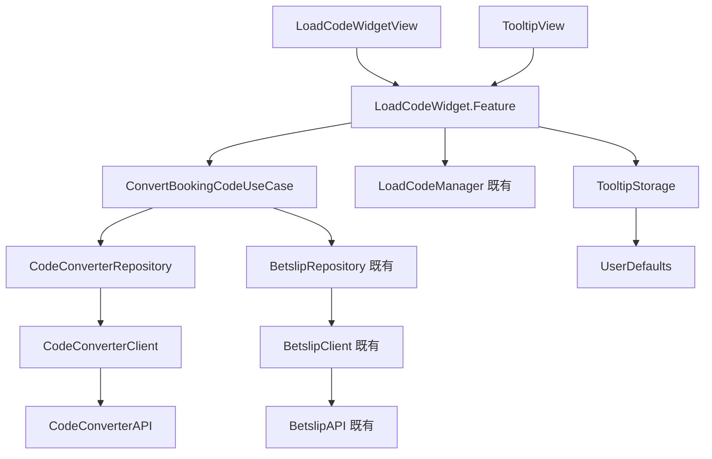

# Module Responsibility

## ⚠️ BE 新設計更新 (2025-01-14)

| 變更項目 | 說明 |
|----------|------|
| **Bookie 相關元件移除** | `BookieDropdownView`, `BookieSelectorSheet` 已廢棄 |
| **Config 相關移除** | `LoadProviderConfigUseCase`, Config API 已廢棄 |
| **Tooltip 新增** | 新增 `TooltipView` 和 `TooltipStorage` |

---

## 復用策略總覽

```
┌────────────────────────────────────────────────────────────────────────┐
│                         復用優先級                                      │
├────────────────────────────────────────────────────────────────────────┤
│  1. 最大復用：擴展現有 LoadBookingCodeSectionView 結構                   │
│  2. 最小改動：保持現有 API 相容性，新增功能以 optional 方式加入           │
│  3. 漸進式替換：先擴展，再逐步替換 LoadCodeViewController                │
│  4. 簡化流程：不再需要 Bookie/Country 選擇                              │
└────────────────────────────────────────────────────────────────────────┘
```

---

## View Modules（UI Layer）

### 擴展的 View

| View 名稱 | 原檔案 | 變更類型 | 說明 |
|-----------|--------|----------|------|
| **LoadCodeWidgetView** | `LoadBookingCodeSectionView.swift` | 擴展 | 1. 增加 `inputState` 支援 6 種狀態<br>2. 增加 Error 訊息顯示<br>3. 增加 Loading 提示文字<br>4. 移除 Bookie Dropdown |
| **BookingCodeInputView** | `BookingCodeInputView` (private) | 擴展 | 1. 增加 Error 狀態（紅色邊框）<br>2. 增加清除按鈕 ⊗<br>3. Load 按鈕綠色/灰色狀態 |

### 新增的 View

| View 名稱 | 框架 | 職責 |
|-----------|------|------|
| **TooltipView** | SwiftUI | 1. 首次使用時顯示說明<br>2. 點擊關閉後永久不顯示 |
| **PartialErrorToast** | SwiftUI | 1. 顯示「X selections failed to convert」警告 |

### 廢棄的 View

| View 名稱 | 原因 |
|-----------|------|
| ~~**BookieDropdownView**~~ | 不再需要選擇 Bookie |
| ~~**BookieSelectorSheet**~~ | 不再需要 Bookie 選擇器 |

---

## Feature Modules（Domain Layer）

### 擴展的 Feature

| 模組名稱 | 原檔案 | 變更類型 | 使用的 UseCase |
|----------|--------|----------|----------------|
| **LoadCodeWidget.Feature** | `LoadBookingCodeSection+Feature.swift` | 擴展 | 1. ConvertBookingCodeUseCase（新增）<br>2. 既有的 loadBookingCode 邏輯 |

### State 變更（擴展自 LoadBookingCodeSection.State）

| 屬性 | 類型 | 原有/新增 | 預設值 | 說明 |
|------|------|-----------|--------|------|
| `bookingCode` | String | ✅ 原有 | `""` | 輸入的 Booking Code |
| `selectedCountry` | Region | ✅ 原有 | `.current` | 原流程備用 |
| `isLoading` | Bool | ✅ 原有 | `false` | Loading 狀態 |
| `contentState` | SectionContentState | ✅ 原有 | `.loaded` | Section 狀態 |
| `availableCountries` | [Region] | ✅ 原有 | `[.ghana, .nigeria]` | 可用國家 |
| `enableCodeConverter` | Bool | 🆕 新增 | `true` | 是否啟用 Code Converter |
| `inputState` | WidgetInputState | 🆕 新增 | `.default` | 6 種輸入狀態 |
| `errorMessage` | String? | 🆕 新增 | `nil` | 錯誤訊息 |
| `convertResult` | ConvertResult? | 🆕 新增 | `nil` | 轉換結果 |
| `isTooltipVisible` | Bool | 🆕 新增 | `false` | Tooltip 是否顯示 |
| ~~`selectedBookie`~~ | ~~SelectedBookie?~~ | ❌ 廢棄 | - | ~~已選 Bookie~~ |
| ~~`providerConfigs`~~ | ~~[ProviderConfig]~~ | ❌ 廢棄 | - | ~~Provider 設定~~ |
| ~~`isBookieSelectorPresented`~~ | ~~Bool~~ | ❌ 廢棄 | - | ~~Sheet 顯示~~ |

### Action 變更（擴展自 LoadBookingCodeSection.Action）

| Action | 原有/新增 | 說明 |
|--------|-----------|------|
| `.onAppear` | ✅ 原有 | 頁面出現 |
| `.bookingCodeChanged(String)` | ✅ 原有 | 輸入變更 |
| `.countrySelected(Region)` | ✅ 原有 | 選擇國家（原流程） |
| `.loadBookingCode` | ✅ 原有 | 點擊 Load 按鈕 |
| `.bookingCodeLoadFailed(String)` | ✅ 原有 | 載入失敗（原流程） |
| `.bookingCodeLoaded(CodeResult)` | ✅ 原有 | 載入成功（原流程） |
| `.inputFocused` | 🆕 新增 | 輸入框聚焦 |
| `.inputBlurred` | 🆕 新增 | 輸入框失焦 |
| `.clearButtonTapped` | 🆕 新增 | 點擊清除按鈕 |
| `.tooltipDismissed` | 🆕 新增 | 關閉 Tooltip |
| `.convertCodeCompleted(Result)` | 🆕 新增 | 轉換完成 |
| `.presentBetslip(shareCode, failCnt)` | 🆕 新增 | 載入 Betslip |
| ~~`.bookieDropdownTapped`~~ | ❌ 廢棄 | ~~點擊 Bookie Dropdown~~ |
| ~~`.bookieSelected(provider, country)`~~ | ❌ 廢棄 | ~~選擇 Bookie + Country~~ |
| ~~`.bookieSelectorDismissed`~~ | ❌ 廢棄 | ~~關閉 Sheet~~ |
| ~~`.providerConfigLoaded(Result)`~~ | ❌ 廢棄 | ~~Config 載入完成~~ |

---

## UseCase Modules

| UseCase 名稱 | 狀態 | 職責 | Input Model | Output Model | 使用的 Repository |
|--------------|------|------|-------------|--------------|-------------------|
| **ConvertBookingCodeUseCase** | 🆕 新增 | 1. 執行 Code2Code 轉換<br>2. 整合 Liabilities 檢查<br>3. 取得 Betslip Data | `ConvertBookingCodeInput` | `ConvertBookingCodeOutput` | 1. CodeConverterRepository<br>2. BetslipRepository（既有） |
| ~~**LoadProviderConfigUseCase**~~ | ❌ 廢棄 | ~~取得 Provider Country 設定~~ | - | - | - |

---

## Repository Modules

| Repository 名稱 | 狀態 | 職責 | 使用的 Client |
|-----------------|------|------|---------------|
| **CodeConverterRepository** | 🆕 新增 | 1. 執行 Code2Code 轉換<br>2. DTO → Domain Model 轉換 | CodeConverterClient |
| **BetslipRepository** | ✅ 既有復用 | 1. Liabilities 檢查<br>2. Betslip Data 取得 | BetslipClient |

---

## Client Modules

| Client 名稱 | 狀態 | 技術 | 使用的 API |
|-------------|------|------|-----------|
| **CodeConverterClient** | 🆕 新增 | HTTP | CodeConverterAPI |
| **BetslipClient** | ✅ 既有復用 | HTTP | BetslipAPI |

---

## Storage Modules

| Storage 名稱 | 狀態 | 技術 | 說明 |
|--------------|------|------|------|
| **TooltipStorage** | 🆕 新增 | UserDefaults | Tooltip 顯示狀態儲存，以 Device ID 判斷 |

---

## API Modules

| API 名稱 | 狀態 | Endpoints |
|----------|------|-----------|
| **CodeConverterAPI** | 🆕 新增 | `POST /orders/converter/code` |
| **BetslipAPI** | ✅ 既有復用 | 1. `GET /bookingCode/{shareCode}/liabilities`<br>2. `GET /orders/share/{shareCode}` |
| ~~**Config API**~~ | ❌ 廢棄 | ~~`GET /orders/converter/config/providerCountries`~~ |

---

## 替換計畫

### Phase 1: 擴展 LoadBookingCodeSectionView

```swift
// 保持向後相容，新功能以 optional 方式加入
struct LoadCodeWidgetView: View {
    let store: StoreOf<LoadCodeWidget.Feature>
    
    // 新增：是否啟用 Code Converter 功能
    var enableCodeConverter: Bool = true
    
    var body: some View {
        // 簡化結構：只有輸入框 + Load 按鈕
        // 不再需要 Bookie Dropdown
    }
}
```

### Phase 2: 替換 LoadCodeViewController

| 入口點 | 變更 |
|--------|------|
| **Code Center** | `LoadCodeViewWrapper` → 直接使用 `LoadCodeWidgetView` |
| **首頁 Widget** | 原地替換，無需改動父層 |
| **Betslip Empty** | 新增嵌入 `LoadCodeWidgetView` |

### Phase 3: 移除舊程式碼

```
刪除：
- LoadCodeViewController.swift
- LoadCodeViewController.xib
- LoadCodeViewWrapper.swift
- BookieDropdownView.swift (如已建立)
- BookieSelectorSheet.swift (如已建立)
```

---

## 模組依賴關係



---

## 廢棄項目清單

| 項目 | 類型 | 原因 |
|------|------|------|
| `BookieDropdownView` | View | 不再需要選擇 Bookie |
| `BookieSelectorSheet` | View | 不再需要 Bookie 選擇器 |
| `LoadProviderConfigUseCase` | UseCase | Config API 已廢棄 |
| `selectedBookie` | State | 不再需要 Bookie 選擇 |
| `providerConfigs` | State | 不再需要 Config 資料 |
| `isBookieSelectorPresented` | State | 不再需要 Sheet |
| `bookieDropdownTapped` | Action | 不再需要 Dropdown |
| `bookieSelected` | Action | 不再需要選擇 |
| `providerConfigLoaded` | Action | Config API 已廢棄 |
