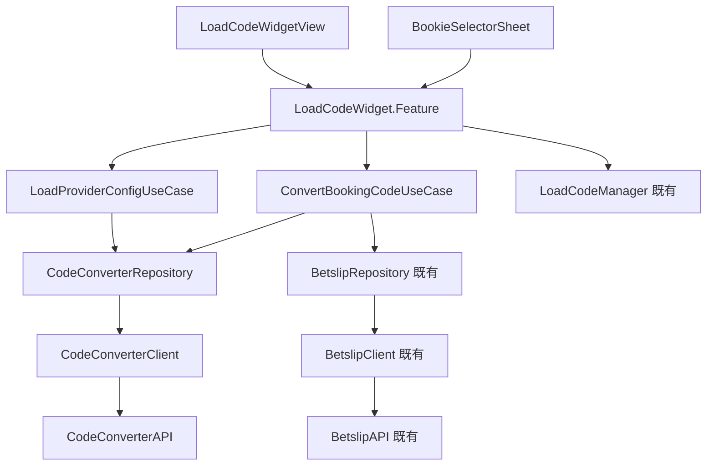

# Module Responsibility

## 復用策略總覽

```
┌────────────────────────────────────────────────────────────────────────┐
│                         復用優先級                                      │
├────────────────────────────────────────────────────────────────────────┤
│  1. 最大復用：擴展現有 LoadBookingCodeSectionView 結構                   │
│  2. 最小改動：保持現有 API 相容性，新增功能以 optional 方式加入           │
│  3. 漸進式替換：先擴展，再逐步替換 LoadCodeViewController                │
└────────────────────────────────────────────────────────────────────────┘
```

---

## View Modules（UI Layer）

### 擴展的 View

| View 名稱 | 原檔案 | 變更類型 | 說明 |
|-----------|--------|----------|------|
| **LoadCodeWidgetView** | `LoadBookingCodeSectionView.swift` | 擴展 | 1. 增加 `inputState` 支援 6 種狀態<br>2. 增加 Error 訊息顯示<br>3. 增加 Loading 提示文字 |
| **BookieDropdownView** | `CountryDropdownView` (private) | 擴展 | 1. 顯示 Bookie 名稱 + Country<br>2. 點擊開啟 `BookieSelectorSheet`<br>3. 支援長名稱截斷 |
| **BookingCodeInputView** | `BookingCodeInputView` (private) | 擴展 | 1. 增加 Error 狀態（紅色邊框）<br>2. 增加清除按鈕 ⊗<br>3. Load 按鈕綠色/灰色狀態 |

### 新增的 View

| View 名稱 | 框架 | 職責 |
|-----------|------|------|
| **BookieSelectorSheet** | SwiftUI | 1. Bottom Sheet 容器<br>2. 雙欄選擇器（Bookie + Country）<br>3. 處理選擇邏輯（單國家自動關閉、多國家需選擇） |
| **PartialErrorToast** | SwiftUI | 1. 顯示「X selections failed to convert」警告 |

---

## Feature Modules（Domain Layer）

### 擴展的 Feature

| 模組名稱 | 原檔案 | 變更類型 | 使用的 UseCase |
|----------|--------|----------|----------------|
| **LoadCodeWidget.Feature** | `LoadBookingCodeSection+Feature.swift` | 擴展 | 1. LoadProviderConfigUseCase（新增）<br>2. ConvertBookingCodeUseCase（新增）<br>3. 既有的 loadBookingCode 邏輯 |

### State 變更（擴展自 LoadBookingCodeSection.State）

| 屬性 | 類型 | 原有/新增 | 說明 |
|------|------|-----------|------|
| `bookingCode` | String | ✅ 原有 | 輸入的 Booking Code |
| `selectedCountry` | Region | ⚠️ 改為 Optional | 需與 Bookie 配合 |
| `isLoading` | Bool | ✅ 原有 | Loading 狀態 |
| `contentState` | SectionContentState | ✅ 原有 | Section 狀態 |
| `availableCountries` | [Region] | ⚠️ 動態化 | 由 API 決定 |
| `selectedBookie` | SelectedBookie? | 🆕 新增 | 已選擇的 Bookie |
| `providerConfigs` | [ProviderConfig] | 🆕 新增 | Provider 設定列表 |
| `inputState` | WidgetInputState | 🆕 新增 | Widget 輸入狀態 |
| `isBookieSelectorPresented` | Bool | 🆕 新增 | Sheet 顯示狀態 |
| `errorMessage` | String? | 🆕 新增 | 錯誤訊息 |

### Action 變更（擴展自 LoadBookingCodeSection.Action）

| Action | 原有/新增 | 說明 |
|--------|-----------|------|
| `.onAppear` | ✅ 原有 | 頁面出現 |
| `.bookingCodeChanged(String)` | ✅ 原有 | 輸入變更 |
| `.countrySelected(Region)` | ✅ 原有 | 選擇國家 |
| `.loadBookingCode` | ✅ 原有 | 載入 Booking Code |
| `.bookieDropdownTapped` | 🆕 新增 | 點擊 Bookie Dropdown |
| `.bookieSelected(provider, country)` | 🆕 新增 | 選擇 Bookie |
| `.bookieSelectorDismissed` | 🆕 新增 | 關閉 Sheet |
| `.inputFocused` | 🆕 新增 | 輸入框聚焦 |
| `.inputBlurred` | 🆕 新增 | 輸入框失焦 |
| `.clearButtonTapped` | 🆕 新增 | 清除按鈕 |
| `.providerConfigLoaded(Result)` | 🆕 新增 | Config 載入完成 |
| `.convertCodeCompleted(Result)` | 🆕 新增 | 轉換完成 |

---

## UseCase Modules（新增）

| UseCase 名稱 | 層級 | 職責 | Input Model | Output Model | 使用的 Repository |
|--------------|------|------|-------------|--------------|-------------------|
| **LoadProviderConfigUseCase** | Domain Layer | 取得 Provider Country 設定 | 無參數 | `[ProviderConfig]` | CodeConverterRepository |
| **ConvertBookingCodeUseCase** | Domain Layer | 1. 執行 Code2Code 轉換<br>2. 整合 Liabilities 檢查<br>3. 取得 Betslip Data | `ConvertBookingCodeInput` | `ConvertBookingCodeOutput` | 1. CodeConverterRepository<br>2. BetslipRepository（既有） |

---

## Repository Modules

| Repository 名稱 | 狀態 | 職責 | 使用的 Client |
|-----------------|------|------|---------------|
| **CodeConverterRepository** | 🆕 新增 | 1. 取得 Provider Config<br>2. 執行 Code2Code 轉換<br>3. DTO → Domain Model 轉換 | CodeConverterClient |
| **BetslipRepository** | ✅ 既有復用 | 1. Liabilities 檢查<br>2. Betslip Data 取得 | BetslipClient |

---

## Client Modules

| Client 名稱 | 狀態 | 技術 | 使用的 API |
|-------------|------|------|-----------|
| **CodeConverterClient** | 🆕 新增 | HTTP | CodeConverterAPI |
| **BetslipClient** | ✅ 既有復用 | HTTP | BetslipAPI |

---

## API Modules

| API 名稱 | 狀態 | Endpoints |
|----------|------|-----------|
| **CodeConverterAPI** | 🆕 新增 | 1. `GET /orders/converter/config/providerCountries`<br>2. `POST /orders/converter/code` |
| **BetslipAPI** | ✅ 既有復用 | 1. `GET /bookingCode/{shareCode}/liabilities`<br>2. `GET /orders/share/{shareCode}` |

---

## 替換計畫

### Phase 1: 擴展 LoadBookingCodeSectionView

```swift
// 保持向後相容，新功能以 optional 方式加入
struct LoadCodeWidgetView: View {
    let store: StoreOf<LoadCodeWidget.Feature>
    
    // 新增：是否啟用 Code Converter 功能
    var enableCodeConverter: Bool = true
    
    var body: some View {
        // 基本結構與原本相同
        // 根據 enableCodeConverter 決定顯示 Bookie Dropdown 還是 Country Dropdown
    }
}
```

### Phase 2: 替換 LoadCodeViewController

| 入口點 | 變更 |
|--------|------|
| **Code Center** | `LoadCodeViewWrapper` → 直接使用 `LoadCodeWidgetView` |
| **首頁 Widget** | 原地替換，無需改動父層 |
| **Betslip Empty** | 新增嵌入 `LoadCodeWidgetView` |

### Phase 3: 移除舊程式碼

```
刪除：
- LoadCodeViewController.swift
- LoadCodeViewController.xib
- LoadCodeViewWrapper.swift
```

---

## 模組依賴關係


