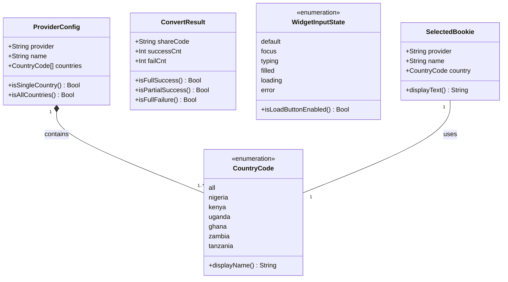

# Domain Model UML

## 類別圖



---

## 關係說明

| 關係 | 語意化關係 | 標準 UML | 說明 | 實作方式 | 方向 |
|------|------------|----------|------|----------|------|
| ProviderConfig → CountryCode | contains | Composition (*--) | ProviderConfig 包含多個 CountryCode | Array property | ProviderConfig → CountryCode |
| SelectedBookie → CountryCode | uses | Association (--) | SelectedBookie 使用一個 CountryCode | Property | SelectedBookie → CountryCode |

---

## 狀態圖

### WidgetInputState 狀態轉換

```mermaid
stateDiagram-v2
    [*] --> Default
    Default --> Focus : 點擊輸入框
    Focus --> Typing : 開始輸入
    Focus --> Default : 失去焦點且無輸入
    Typing --> Filled : 輸入完成
    Typing --> Focus : 清空輸入
    Filled --> Loading : 點擊 Load
    Filled --> Typing : 繼續編輯
    Loading --> Error : API 失敗
    Loading --> [*] : API 成功 載入 Betslip
    Error --> Typing : 修改輸入
    Error --> Loading : 重新 Load
```

