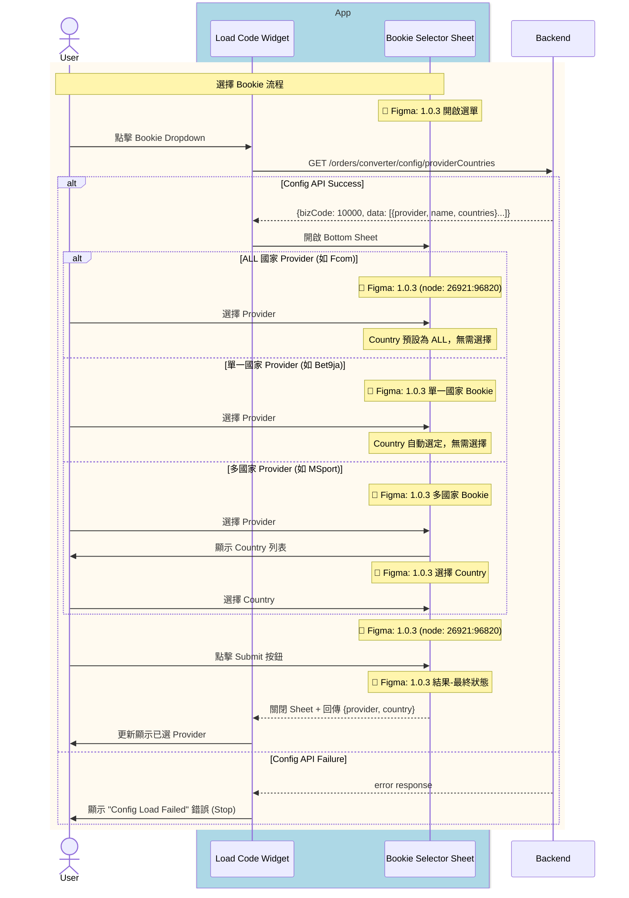
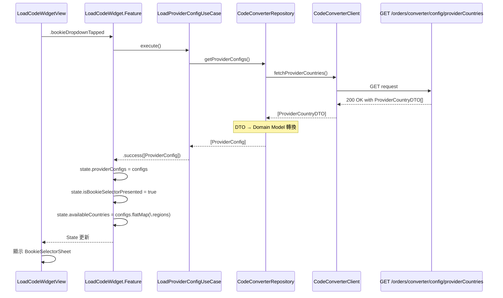
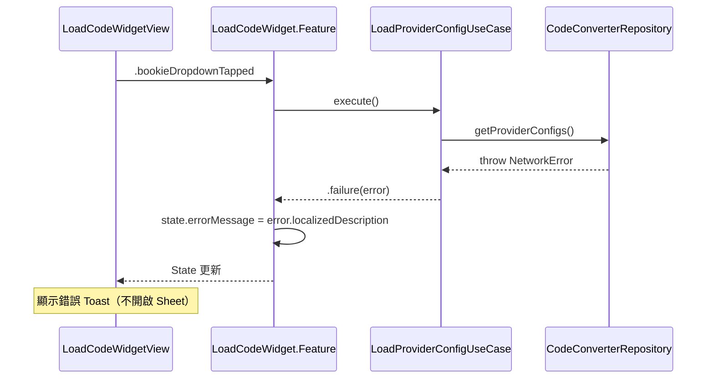

# Module Sequence Diagram: Load Provider Config

## 觸發時機

用戶點擊 Bookie Dropdown 時，載入 Provider Config 並顯示 Bookie Selector Sheet。

---

## 1️⃣ User-Facing Sequence Diagram

此圖展示從用戶視角的互動流程，包含 Figma 設計對應。



<details>
<summary>📝 Mermaid 語法</summary>

```text
sequenceDiagram
    actor User
    
    box rgb(173, 216, 230) App
        participant Widget as Load Code Widget
        participant Selector as Bookie Selector Sheet
    end
    
    participant BE as Backend

    %% 選擇 Bookie (含 Config API)
    rect rgb(255, 250, 240)
        note over User,Selector: 選擇 Bookie 流程
        note over Selector: 📐 Figma: 1.0.3 開啟選單
        User->>Widget: 點擊 Bookie Dropdown
        Widget->>BE: GET /orders/converter/config/providerCountries
        
        alt Config API Success
            BE-->>Widget: {bizCode: 10000, data: [{provider, name, countries}...]}
            Widget->>Selector: 開啟 Bottom Sheet
            
            alt ALL 國家 Provider (如 Fcom)
                note over Selector: 📐 Figma: 1.0.3 (node: 26921:96820)
                User->>Selector: 選擇 Provider
                note over Selector: Country 預設為 ALL，無需選擇
            else 單一國家 Provider (如 Bet9ja)
                note over Selector: 📐 Figma: 1.0.3 單一國家 Bookie
                User->>Selector: 選擇 Provider
                note over Selector: Country 自動選定，無需選擇
            else 多國家 Provider (如 MSport)
                note over Selector: 📐 Figma: 1.0.3 多國家 Bookie
                User->>Selector: 選擇 Provider
                Selector->>User: 顯示 Country 列表
                note over Selector: 📐 Figma: 1.0.3 選擇 Country
                User->>Selector: 選擇 Country
            end
            
            note over Selector: 📐 Figma: 1.0.3 (node: 26921:96820)
            User->>Selector: 點擊 Submit 按鈕
            note over Selector: 📐 Figma: 1.0.3 結果-最終狀態
            Selector-->>Widget: 關閉 Sheet + 回傳 {provider, country}
            Widget->>User: 更新顯示已選 Provider
        
        else Config API Failure
            BE-->>Widget: error response
            Widget->>User: 顯示 "Config Load Failed" 錯誤 (Stop)
        end
    end
```

</details>

### Figma Frame 對應表

| 流程階段 | Figma Frame | Node ID |
|----------|-------------|---------|
| 開啟選單 | 1.0.3 | `26753:64425` |
| 單一國家 Bookie | 1.0.3 | `26753:64562` |
| 多國家 Bookie | 1.0.3 | `26753:64699` |
| 選擇 Country | 1.0.3 | `26753:64836` |
| Submit 按鈕 | 1.0.3 | `26921:96820` |
| 結果 - 最終狀態 | 1.0.3 | `26753:85011` |

### Provider 類型對照表

| 類型 | 範例 | `countries` 值 | Country 選擇行為 |
|------|------|----------------|------------------|
| **ALL 國家** | Fcom | `["ALL"]` | 預設為 ALL，無需選擇 |
| **單一國家** | Bet9ja | `["NG"]` | 自動選定，無需選擇 |
| **多國家** | MSport | `["NG", "GH", "UG", "ZM"]` | 需要選擇 Country |

---

## 2️⃣ Codebase-Level Sequence Diagram

此圖展示 Clean Architecture 各層之間的呼叫關係。



<details>
<summary>📝 Mermaid 語法</summary>

```text
sequenceDiagram
    participant UI as LoadCodeWidgetView
    participant Feature as LoadCodeWidget.Feature
    participant UC as LoadProviderConfigUseCase
    participant Repo as CodeConverterRepository
    participant Client as CodeConverterClient
    participant API as GET /orders/converter/config/providerCountries

    UI->>Feature: .bookieDropdownTapped
    
    Feature->>UC: execute()
    
    UC->>Repo: getProviderConfigs()
    
    Repo->>Client: fetchProviderCountries()
    
    Client->>API: GET request
    API-->>Client: 200 OK with ProviderCountryDTO[]
    
    Client-->>Repo: [ProviderCountryDTO]
    
    Note over Repo: DTO → Domain Model 轉換
    Repo-->>UC: [ProviderConfig]
    
    UC-->>Feature: .success([ProviderConfig])
    
    Feature->>Feature: state.providerConfigs = configs
    Feature->>Feature: state.isBookieSelectorPresented = true
    Feature->>Feature: state.availableCountries = configs.flatMap(\.regions)
    
    Feature-->>UI: State 更新
    
    UI->>UI: 顯示 BookieSelectorSheet
```

</details>

---

## API Request/Response

### Request

```http
GET /orders/converter/config/providerCountries
Authorization: Bearer {token}
```

### Response (200 OK)

```json
{
  "bizCode": 10000,
  "message": "success",
  "data": [
    {
      "provider": "bet9ja",
      "name": "Bet9ja",
      "countries": ["NG"]
    },
    {
      "provider": "betway",
      "name": "Betway",
      "countries": ["GH", "NG", "KE", "TZ", "UG", "ZM"]
    },
    {
      "provider": "fcom",
      "name": "Fcom",
      "countries": ["ALL"]
    }
  ]
}
```

---

## State 變更

| Before | After |
|--------|-------|
| `providerConfigs = []` | `providerConfigs = [ProviderConfig(...), ...]` |
| `isBookieSelectorPresented = false` | `isBookieSelectorPresented = true` |
| `availableCountries = [.ghana, .nigeria]` | `availableCountries = [所有 API 返回的國家]` |

---

## 錯誤處理



---

## Code 實作參考

### UseCase

```swift
struct LoadProviderConfigUseCase {
    @Dependency(\.codeConverterRepository) var repository
    
    func execute() async -> Result<[ProviderConfig], Error> {
        do {
            let configs = try await repository.getProviderConfigs()
            return .success(configs)
        } catch {
            return .failure(error)
        }
    }
}
```

### Repository

```swift
struct CodeConverterRepository {
    @Dependency(\.codeConverterClient) var client
    
    func getProviderConfigs() async throws -> [ProviderConfig] {
        let dtos = try await client.fetchProviderCountries()
        return dtos.map { ProviderConfig(from: $0) }
    }
}
```
