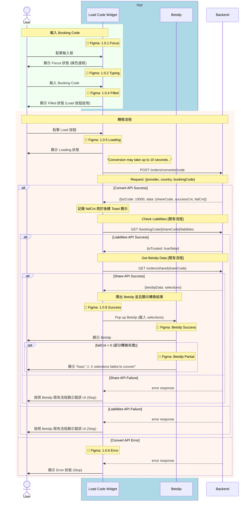
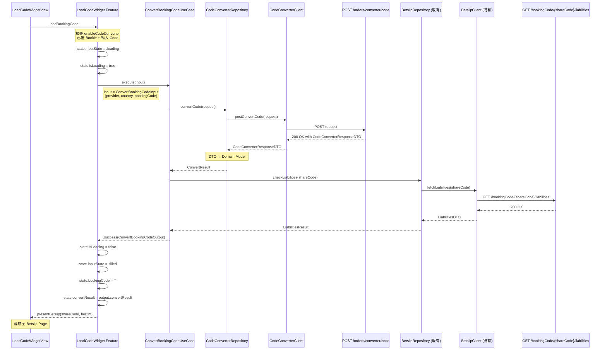
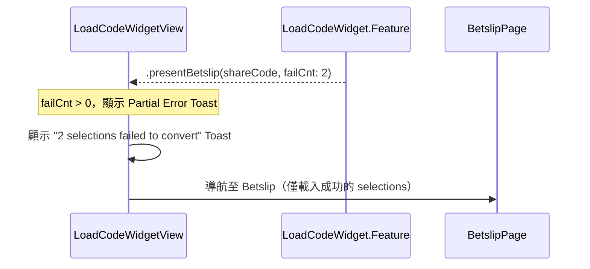
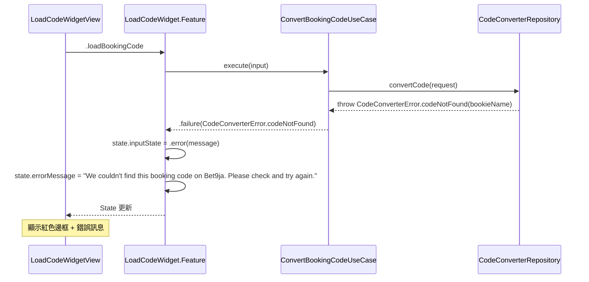
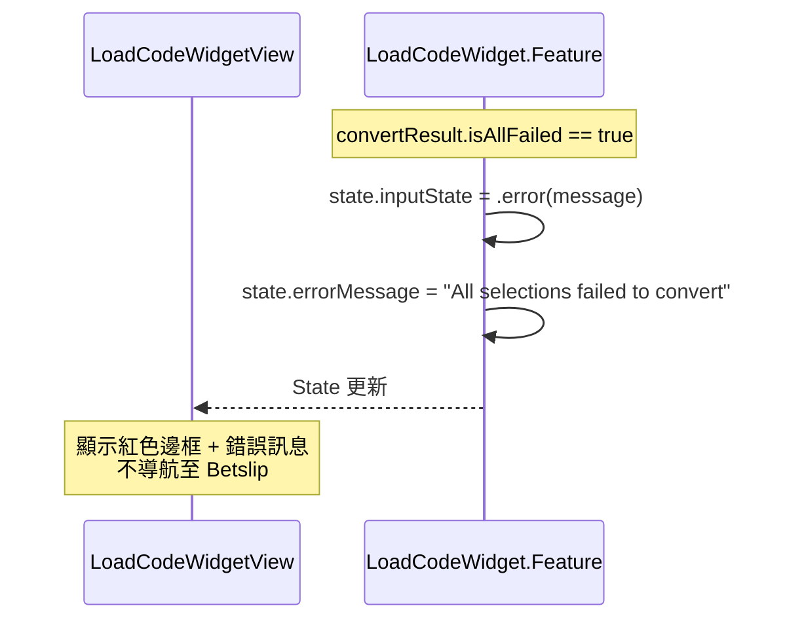
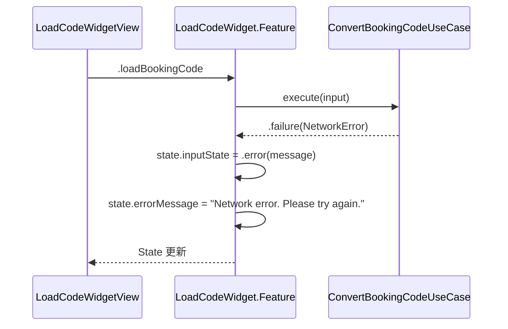

# Module Sequence Diagram: Convert Booking Code (Code2Code)

## 觸發時機

用戶點擊 Load 按鈕，執行 Code2Code 轉換流程。

---

## 1️⃣ User-Facing Sequence Diagram

此圖展示從用戶視角的完整轉換流程，包含 Figma 設計對應。



<details>
<summary>📝 Mermaid 語法</summary>

```text
sequenceDiagram
    actor User
    
    box rgb(173, 216, 230) App
        participant Widget as Load Code Widget
        participant Betslip as Betslip
    end
    
    participant BE as Backend

    %% 輸入 Booking Code
    rect rgb(240, 255, 240)
        note over User,Widget: 輸入 Booking Code
        note over Widget: 📐 Figma: 1.0.1 Focus
        User->>Widget: 點擊輸入框
        Widget->>User: 顯示 Focus 狀態 (綠色邊框)
        note over Widget: 📐 Figma: 1.0.2 Typing
        User->>Widget: 輸入 Booking Code
        note over Widget: 📐 Figma: 1.0.4 Filled
        Widget->>User: 顯示 Filled 狀態 (Load 按鈕啟用)
    end

    %% 轉換流程
    rect rgb(255, 245, 238)
        note over User,BE: 轉換流程
        User->>Widget: 點擊 Load 按鈕
        note over Widget: 📐 Figma: 1.0.5 Loading
        Widget->>User: 顯示 Loading 狀態
        note right of Widget: "Conversion may take up to 10 seconds..."
        
        Widget->>BE: POST /orders/converter/code
        note over Widget,BE: Request: {provider, country, bookingCode}
        
        alt Convert API Success
            BE-->>Widget: {bizCode: 10000, data: {shareCode, successCnt, failCnt}}
            note over Widget: 記錄 failCnt 用於後續 Toast 顯示
            
            %% Check Liabilities [既有流程]
            note over Widget,BE: Check Liabilities [既有流程]
            Widget->>BE: GET /bookingCode/[shareCode]/liabilities
            
            alt Liabilities API Success
                BE-->>Widget: {isTrusted: true/false}
                
                %% Get Betslip Data [既有流程]
                note over Widget,BE: Get Betslip Data [既有流程]
                Widget->>BE: GET /orders/share/[shareCode]
                
                alt Share API Success
                    BE-->>Widget: {betslipData: selections}
                    
                    %% 彈出 Betslip 並且顯示轉換結果
                    note over Widget,Betslip: 彈出 Betslip 並且顯示轉換結果
                    note over Widget: 📐 Figma: 1.0.8 Success
                    Widget->>Betslip: Pop up Betslip (載入 selections)
                    note over Betslip: 📐 Figma: Betslip Success
                    Betslip->>User: 顯示 Betslip
                    
                    opt failCnt > 0 (部分轉換失敗)
                        note over Betslip: 📐 Figma: Betslip Partial
                        Betslip->>User: 顯示 Toast "⚠ X selections failed to convert"
                    end
                    
                else Share API Failure
                    BE-->>Widget: error response
                    Widget->>User: 按照 Betslip 既有流程顯示錯誤 UI (Stop)
                end
                
            else Liabilities API Failure
                BE-->>Widget: error response
                Widget->>User: 按照 Betslip 既有流程顯示錯誤 UI (Stop)
            end
            
        else Convert API Error
            note over Widget: 📐 Figma: 1.0.6 Error
            BE-->>Widget: error response
            Widget->>User: 顯示 Error 狀態 (Stop)
        end
    end
```

</details>

### Figma Frame 對應表

| 流程階段 | Figma Frame | Node ID | Widget 狀態 |
|----------|-------------|---------|-------------|
| 輸入框聚焦 | 1.0.1 | `26769:88868` | Focus |
| 正在輸入 | 1.0.2 | - | Typing |
| 輸入完成 | 1.0.4 | `26453:93265` | Filled |
| 轉換中 | 1.0.5 | - | Loading |
| 轉換失敗 | 1.0.6 | - | Error |
| 轉換成功 | 1.0.8 | `26453:93267` | → Betslip |
| Betslip 成功 | - | `26428:71768` | failCnt == 0 |
| Betslip 部分成功 | - | `26428:71769` | failCnt > 0 |

### API 調用順序

| 順序 | API | Method | Figma 狀態 | 失敗處理 |
|:----:|-----|--------|------------|----------|
| 1 | `/orders/converter/code` | `POST` | 1.0.5 Loading | 1.0.6 Error |
| 2 | `/bookingCode/[shareCode]/liabilities` | `GET` | [既有流程] | Betslip 既有錯誤 UI |
| 3 | `/orders/share/[shareCode]` | `GET` | [既有流程] | Betslip 既有錯誤 UI |

---

## 2️⃣ Codebase-Level Sequence Diagram

此圖展示 Clean Architecture 各層之間的呼叫關係。



<details>
<summary>📝 Mermaid 語法</summary>

```text
sequenceDiagram
    participant UI as LoadCodeWidgetView
    participant Feature as LoadCodeWidget.Feature
    participant UC as ConvertBookingCodeUseCase
    participant CCRepo as CodeConverterRepository
    participant CCClient as CodeConverterClient
    participant ConvertAPI as POST /orders/converter/code
    participant BSRepo as BetslipRepository (既有)
    participant BSClient as BetslipClient (既有)
    participant LiabAPI as GET /bookingCode/{shareCode}/liabilities

    UI->>Feature: .loadBookingCode
    
    Note over Feature: 檢查 enableCodeConverter<br/>已選 Bookie + 輸入 Code
    
    Feature->>Feature: state.inputState = .loading
    Feature->>Feature: state.isLoading = true
    
    Feature->>UC: execute(input)
    Note right of Feature: input = ConvertBookingCodeInput<br/>(provider, country, bookingCode)
    
    %% Step 1: Code2Code 轉換
    UC->>CCRepo: convertCode(request)
    CCRepo->>CCClient: postConvertCode(request)
    CCClient->>ConvertAPI: POST request
    ConvertAPI-->>CCClient: 200 OK with CodeConverterResponseDTO
    CCClient-->>CCRepo: CodeConverterResponseDTO
    Note over CCRepo: DTO → Domain Model
    CCRepo-->>UC: ConvertResult
    
    %% Step 2: Liabilities 檢查 (使用 shareCode)
    UC->>BSRepo: checkLiabilities(shareCode)
    BSRepo->>BSClient: fetchLiabilities(shareCode)
    BSClient->>LiabAPI: GET /bookingCode/{shareCode}/liabilities
    LiabAPI-->>BSClient: 200 OK
    BSClient-->>BSRepo: LiabilitiesDTO
    BSRepo-->>UC: LiabilitiesResult
    
    %% Step 3: 回傳結果
    UC-->>Feature: .success(ConvertBookingCodeOutput)
    
    Feature->>Feature: state.isLoading = false
    Feature->>Feature: state.inputState = .filled
    Feature->>Feature: state.bookingCode = ""
    Feature->>Feature: state.convertResult = output.convertResult
    
    Feature-->>UI: .presentBetslip(shareCode, failCnt)
    
    Note over UI: 導航至 Betslip Page
```

</details>

---

## API Request/Response

### Convert Code Request

```http
POST /orders/converter/code
Content-Type: application/json
Authorization: Bearer {token}

{
  "provider": "bet9ja",
  "country": "NG",
  "bookingCode": "3RA3FA"
}
```

### Convert Code Response (200 OK)

```json
{
  "bizCode": 10000,
  "message": "success",
  "data": {
    "shareCode": "FCOM123ABC",
    "successCnt": 3,
    "failCnt": 1
  }
}
```

---

## Partial Failure 流程

當部分 selections 轉換失敗時 (`failCnt > 0`)：



<details>
<summary>📝 Mermaid 語法</summary>

```text
sequenceDiagram
    participant UI as LoadCodeWidgetView
    participant Feature as LoadCodeWidget.Feature
    participant Betslip as BetslipPage

    Feature-->>UI: .presentBetslip(shareCode, failCnt: 2)
    
    Note over UI: failCnt > 0，顯示 Partial Error Toast
    
    UI->>UI: 顯示 "2 selections failed to convert" Toast
    
    UI->>Betslip: 導航至 Betslip（僅載入成功的 selections）
```

</details>

---

## Error Handling

### 1. Code Not Found (CC002)



<details>
<summary>📝 Mermaid 語法</summary>

```text
sequenceDiagram
    participant UI as LoadCodeWidgetView
    participant Feature as LoadCodeWidget.Feature
    participant UC as ConvertBookingCodeUseCase
    participant CCRepo as CodeConverterRepository

    UI->>Feature: .loadBookingCode
    
    Feature->>UC: execute(input)
    
    UC->>CCRepo: convertCode(request)
    CCRepo-->>UC: throw CodeConverterError.codeNotFound(bookieName)
    
    UC-->>Feature: .failure(CodeConverterError.codeNotFound)
    
    Feature->>Feature: state.inputState = .error(message)
    Feature->>Feature: state.errorMessage = "We couldn't find this booking code on Bet9ja. Please check and try again."
    
    Feature-->>UI: State 更新
    
    Note over UI: 顯示紅色邊框 + 錯誤訊息
```

</details>

### 2. All Selections Failed (CC003)



### 3. Network Error



---

## State 變更對照

| 階段 | inputState | isLoading | bookingCode | errorMessage |
|------|------------|-----------|-------------|--------------|
| 點擊 Load | `.loading` | `true` | "3RA3FA" | `nil` |
| 成功 | `.filled` | `false` | `""` | `nil` |
| 失敗 | `.error(msg)` | `false` | "3RA3FA" | "We couldn't..." |

---

## Code 實作參考

### UseCase

```swift
struct ConvertBookingCodeUseCase {
    @Dependency(\.codeConverterRepository) var codeConverterRepo
    @Dependency(\.betslipRepository) var betslipRepo  // 既有
    
    func execute(_ input: ConvertBookingCodeInput) async -> Result<ConvertBookingCodeOutput, Error> {
        do {
            // Step 1: Code2Code 轉換
            let convertResult = try await codeConverterRepo.convertCode(
                provider: input.provider,
                country: input.country,
                code: input.bookingCode
            )
            
            // 檢查是否全部失敗
            guard !convertResult.isAllFailed else {
                throw CodeConverterError.allSelectionsFailed
            }
            
            // Step 2: Liabilities 檢查（使用返回的 shareCode）
            let liabilities = try await betslipRepo.checkLiabilities(
                shareCode: convertResult.shareCode
            )
            
            return .success(ConvertBookingCodeOutput(
                convertResult: convertResult,
                liabilities: liabilities
            ))
        } catch {
            return .failure(error)
        }
    }
}
```

### Input/Output Model

```swift
struct ConvertBookingCodeInput {
    let provider: String
    let country: String
    let bookingCode: String
}

struct ConvertBookingCodeOutput: Equatable {
    let convertResult: ConvertResult
    let liabilities: LiabilitiesResult
}
```
