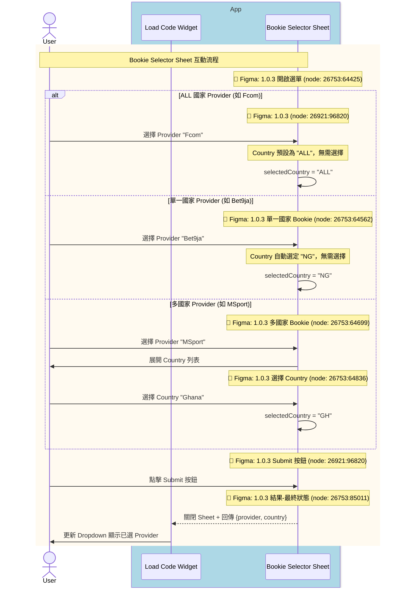
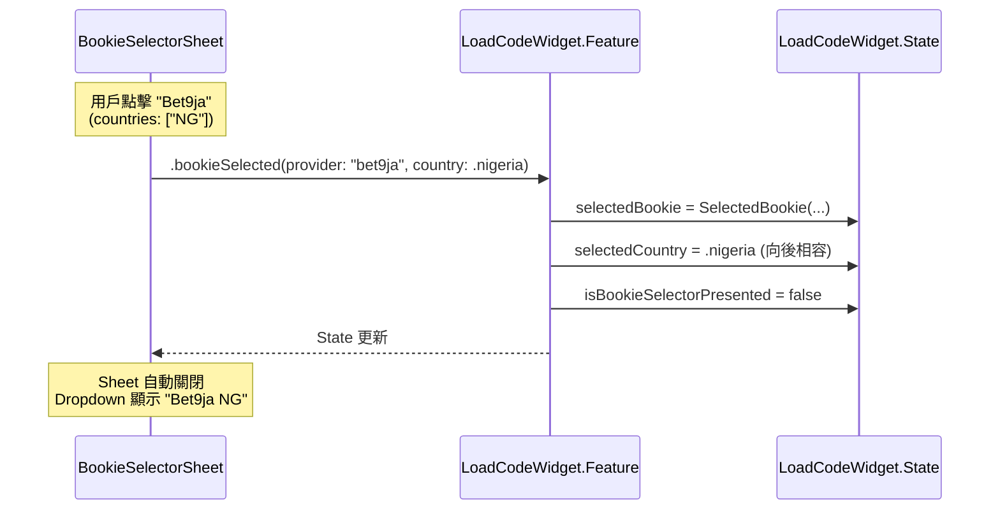
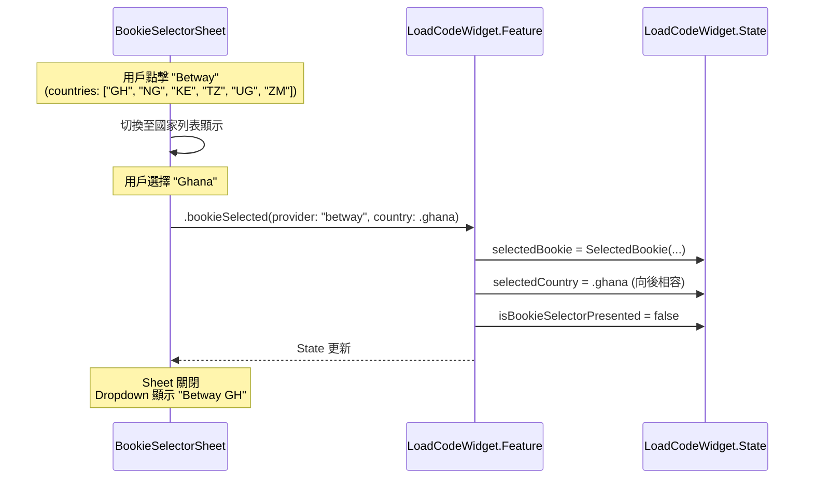
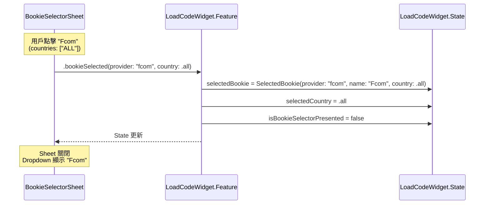
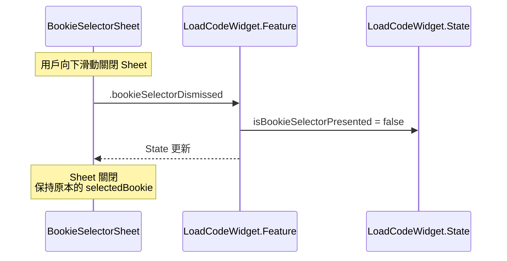

# Module Sequence Diagram: Bookie Selection

## 情境說明

當用戶從 Bookie Selector Sheet 選擇 Bookie 時，有三種情況：

1. **ALL 國家 Provider**：如 Fcom，Country 預設為 ALL，無需選擇
2. **單一國家 Bookie**：如 Bet9ja，Country 自動選定，無需選擇
3. **多國家 Bookie**：如 MSport，需要先選擇 Country

---

## 1️⃣ User-Facing Sequence Diagram

此圖展示從用戶視角的 Bookie 選擇流程，包含 Figma 設計對應。



<details>
<summary>📝 Mermaid 語法</summary>

```text
sequenceDiagram
    actor User
    
    box rgb(173, 216, 230) App
        participant Widget as Load Code Widget
        participant Selector as Bookie Selector Sheet
    end

    %% Bookie 選擇流程
    rect rgb(255, 250, 240)
        note over User,Selector: Bookie Selector Sheet 互動流程
        note over Selector: 📐 Figma: 1.0.3 開啟選單 (node: 26753:64425)
        
        alt ALL 國家 Provider (如 Fcom)
            note over Selector: 📐 Figma: 1.0.3 (node: 26921:96820)
            User->>Selector: 選擇 Provider "Fcom"
            note over Selector: Country 預設為 "ALL"，無需選擇
            Selector->>Selector: selectedCountry = "ALL"
        else 單一國家 Provider (如 Bet9ja)
            note over Selector: 📐 Figma: 1.0.3 單一國家 Bookie (node: 26753:64562)
            User->>Selector: 選擇 Provider "Bet9ja"
            note over Selector: Country 自動選定 "NG"，無需選擇
            Selector->>Selector: selectedCountry = "NG"
        else 多國家 Provider (如 MSport)
            note over Selector: 📐 Figma: 1.0.3 多國家 Bookie (node: 26753:64699)
            User->>Selector: 選擇 Provider "MSport"
            Selector->>User: 展開 Country 列表
            note over Selector: 📐 Figma: 1.0.3 選擇 Country (node: 26753:64836)
            User->>Selector: 選擇 Country "Ghana"
            Selector->>Selector: selectedCountry = "GH"
        end
        
        note over Selector: 📐 Figma: 1.0.3 Submit 按鈕 (node: 26921:96820)
        User->>Selector: 點擊 Submit 按鈕
        
        note over Selector: 📐 Figma: 1.0.3 結果-最終狀態 (node: 26753:85011)
        Selector-->>Widget: 關閉 Sheet + 回傳 {provider, country}
        Widget->>User: 更新 Dropdown 顯示已選 Provider
    end
```

</details>

### Figma Frame 對應表

| 流程階段 | Figma Frame | Node ID |
|----------|-------------|---------|
| 開啟選單 | 1.0.3 | `26753:64425` |
| 單一國家 Bookie | 1.0.3 | `26753:64562` |
| 多國家 Bookie | 1.0.3 | `26753:64699` |
| 選擇 Country | 1.0.3 | `26753:64836` |
| Click mask to close | 1.0.3 | `26753:64973` |
| Submit 按鈕 | 1.0.3 | `26921:96820` |
| 結果 - 最終狀態 | 1.0.3 | `26753:85011` |

### Provider 類型對照表

| 類型 | 範例 | `countries` 值 | Country 選擇行為 |
|------|------|----------------|------------------|
| **ALL 國家** | Fcom | `["ALL"]` | 預設為 ALL，無需選擇 |
| **單一國家** | Bet9ja | `["NG"]` | 自動選定，無需選擇 |
| **多國家** | MSport | `["NG", "GH", "UG", "ZM"]` | 需要選擇 Country |

---

## 2️⃣ Codebase-Level Sequence Diagrams

此圖展示 Clean Architecture 各層之間的呼叫關係。

### 情境 1: 單一國家 Bookie



<details>
<summary>📝 Mermaid 語法</summary>

```text
sequenceDiagram
    participant UI as BookieSelectorSheet
    participant Feature as LoadCodeWidget.Feature
    participant State as LoadCodeWidget.State

    Note over UI: 用戶點擊 "Bet9ja"<br/>(countries: ["NG"])
    
    UI->>Feature: .bookieSelected(provider: "bet9ja", country: .nigeria)
    
    Feature->>State: selectedBookie = SelectedBookie(...)
    Feature->>State: selectedCountry = .nigeria (向後相容)
    Feature->>State: isBookieSelectorPresented = false
    
    Feature-->>UI: State 更新
    
    Note over UI: Sheet 自動關閉<br/>Dropdown 顯示 "Bet9ja NG"
```

</details>

---

### 情境 2: 多國家 Bookie（兩步選擇）



<details>
<summary>📝 Mermaid 語法</summary>

```text
sequenceDiagram
    participant UI as BookieSelectorSheet
    participant Feature as LoadCodeWidget.Feature
    participant State as LoadCodeWidget.State

    Note over UI: 用戶點擊 "Betway"<br/>(countries: ["GH", "NG", "KE", "TZ", "UG", "ZM"])
    
    UI->>UI: 切換至國家列表顯示
    
    Note over UI: 用戶選擇 "Ghana"
    
    UI->>Feature: .bookieSelected(provider: "betway", country: .ghana)
    
    Feature->>State: selectedBookie = SelectedBookie(...)
    Feature->>State: selectedCountry = .ghana (向後相容)
    Feature->>State: isBookieSelectorPresented = false
    
    Feature-->>UI: State 更新
    
    Note over UI: Sheet 關閉<br/>Dropdown 顯示 "Betway GH"
```

</details>

---

### 情境 3: ALL 國家 Provider



<details>
<summary>📝 Mermaid 語法</summary>

```text
sequenceDiagram
    participant UI as BookieSelectorSheet
    participant Feature as LoadCodeWidget.Feature
    participant State as LoadCodeWidget.State

    Note over UI: 用戶點擊 "Fcom"<br/>(countries: ["ALL"])
    
    UI->>Feature: .bookieSelected(provider: "fcom", country: .all)
    
    Feature->>State: selectedBookie = SelectedBookie(provider: "fcom", name: "Fcom", country: .all)
    Feature->>State: selectedCountry = .all
    Feature->>State: isBookieSelectorPresented = false
    
    Feature-->>UI: State 更新
    
    Note over UI: Sheet 關閉<br/>Dropdown 顯示 "Fcom"
```

</details>

---

### Sheet 關閉（無選擇）



<details>
<summary>📝 Mermaid 語法</summary>

```text
sequenceDiagram
    participant UI as BookieSelectorSheet
    participant Feature as LoadCodeWidget.Feature
    participant State as LoadCodeWidget.State

    Note over UI: 用戶向下滑動關閉 Sheet
    
    UI->>Feature: .bookieSelectorDismissed
    
    Feature->>State: isBookieSelectorPresented = false
    
    Feature-->>UI: State 更新
    
    Note over UI: Sheet 關閉<br/>保持原本的 selectedBookie
```

</details>

---

## State 變更對照

### 選擇前

```swift
state.selectedBookie = SelectedBookie(provider: "bet9ja", name: "Bet9ja", country: .nigeria)
state.selectedCountry = .nigeria
state.isBookieSelectorPresented = true
```

### 選擇後（選擇 Betway Ghana）

```swift
state.selectedBookie = SelectedBookie(provider: "betway", name: "Betway", country: .ghana)
state.selectedCountry = .ghana  // 向後相容
state.isBookieSelectorPresented = false
```

---

## UI 行為規格

### BookieSelectorSheet 行為

| 條件 | 行為 |
|------|------|
| Bookie 有 ALL 國家 | 點擊後直接選定，Country = ALL |
| Bookie 只有單一國家 | 點擊立即選定該國家 |
| Bookie 有多個國家 | 點擊後展開國家列表 |
| 點擊國家 | 選定該國家 |
| 點擊 Submit 按鈕 | 關閉 Sheet，回傳選擇結果 |
| 向下滑動 | 關閉 Sheet（不改變選擇） |
| 點擊背景 (mask) | 關閉 Sheet（不改變選擇） |

### Dropdown 顯示規則

| 條件 | 顯示 |
|------|------|
| ALL 國家 | `{Name}` (不顯示國家) |
| 名稱 ≤ 12 字元 | `{Name} {Country}` |
| 名稱 > 12 字元 | `{Name前12字}… {Country}` |

範例：
- `Fcom` (ALL 國家)
- `Bet9ja NG`
- `SportyBet GH`
- `Bookie Longna… NG`

---

## View 實作參考

### BookieSelectorSheet

```swift
struct BookieSelectorSheet: View {
    let providerConfigs: [ProviderConfig]
    let onSelect: (String, CountryCode) -> Void
    let onDismiss: () -> Void
    
    @State private var expandedProvider: String? = nil
    @State private var selectedProvider: ProviderConfig? = nil
    @State private var selectedCountry: CountryCode? = nil
    
    var body: some View {
        NavigationStack {
            List {
                ForEach(providerConfigs) { config in
                    if config.isAllCountry {
                        // ALL 國家：直接可選
                        BookieRow(config: config, isSelected: selectedProvider?.provider == config.provider)
                            .onTapGesture {
                                selectedProvider = config
                                selectedCountry = .all
                            }
                    } else if config.isSingleCountry {
                        // 單一國家：直接可選
                        BookieRow(config: config, isSelected: selectedProvider?.provider == config.provider)
                            .onTapGesture {
                                selectedProvider = config
                                selectedCountry = config.countries[0]
                            }
                    } else {
                        // 多國家：可展開
                        DisclosureGroup(
                            isExpanded: Binding(
                                get: { expandedProvider == config.provider },
                                set: { if $0 { expandedProvider = config.provider } }
                            )
                        ) {
                            ForEach(config.countries, id: \.self) { country in
                                CountryRow(country: country, isSelected: selectedCountry == country)
                                    .onTapGesture {
                                        selectedProvider = config
                                        selectedCountry = country
                                    }
                            }
                        } label: {
                            BookieRow(config: config, isSelected: selectedProvider?.provider == config.provider)
                        }
                    }
                }
            }
            .navigationTitle("Select Bookie")
            .navigationBarTitleDisplayMode(.inline)
            .toolbar {
                ToolbarItem(placement: .cancellationAction) {
                    Button("Cancel", action: onDismiss)
                }
                ToolbarItem(placement: .confirmationAction) {
                    Button("Submit") {
                        if let provider = selectedProvider, let country = selectedCountry {
                            onSelect(provider.provider, country)
                        }
                    }
                    .disabled(selectedProvider == nil || selectedCountry == nil)
                }
            }
        }
        .presentationDetents([.medium, .large])
        .presentationDragIndicator(.visible)
    }
}
```

### Reducer

```swift
case let .bookieSelected(provider, country):
    guard let config = state.providerConfigs.first(where: { $0.provider == provider }) else {
        return .none
    }
    
    state.selectedBookie = SelectedBookie(
        provider: provider,
        name: config.name,
        country: country
    )
    state.isBookieSelectorPresented = false
    
    // 向後相容：同步更新 selectedCountry
    if let region = Region.from(countryCode: country) {
        state.selectedCountry = region
    }
    
    return .none

case .bookieSelectorDismissed:
    state.isBookieSelectorPresented = false
    return .none
```
