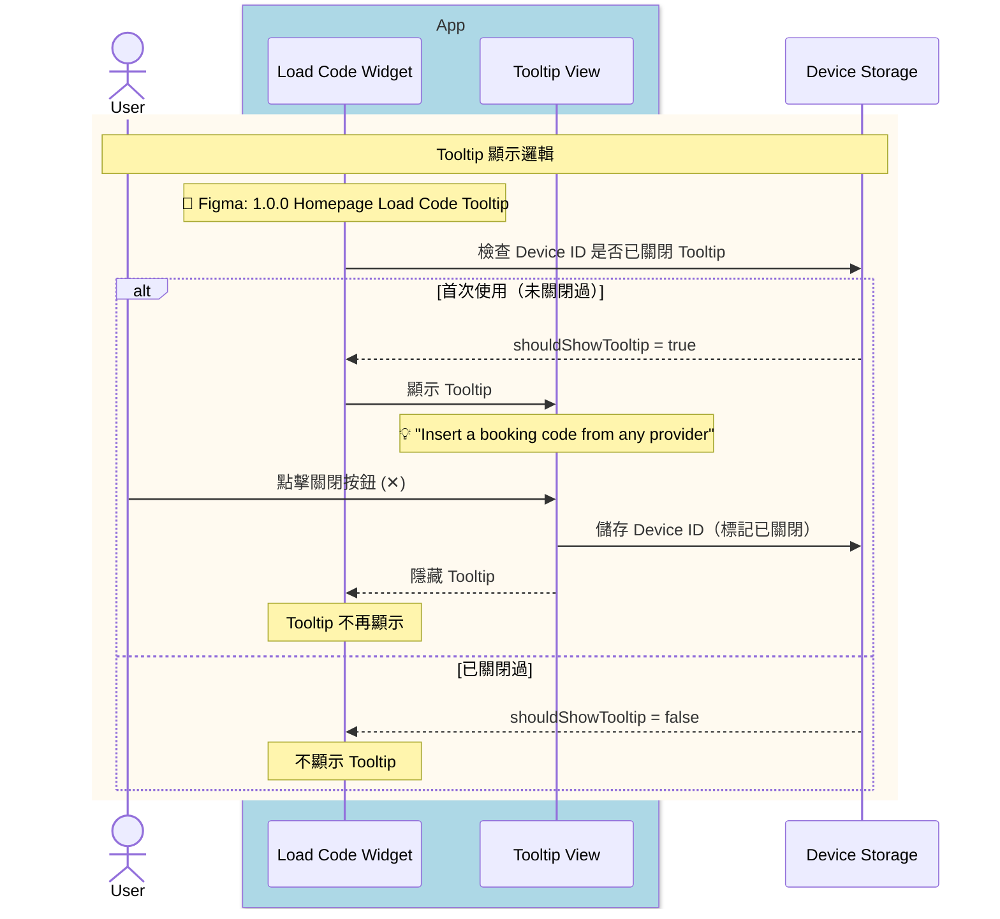
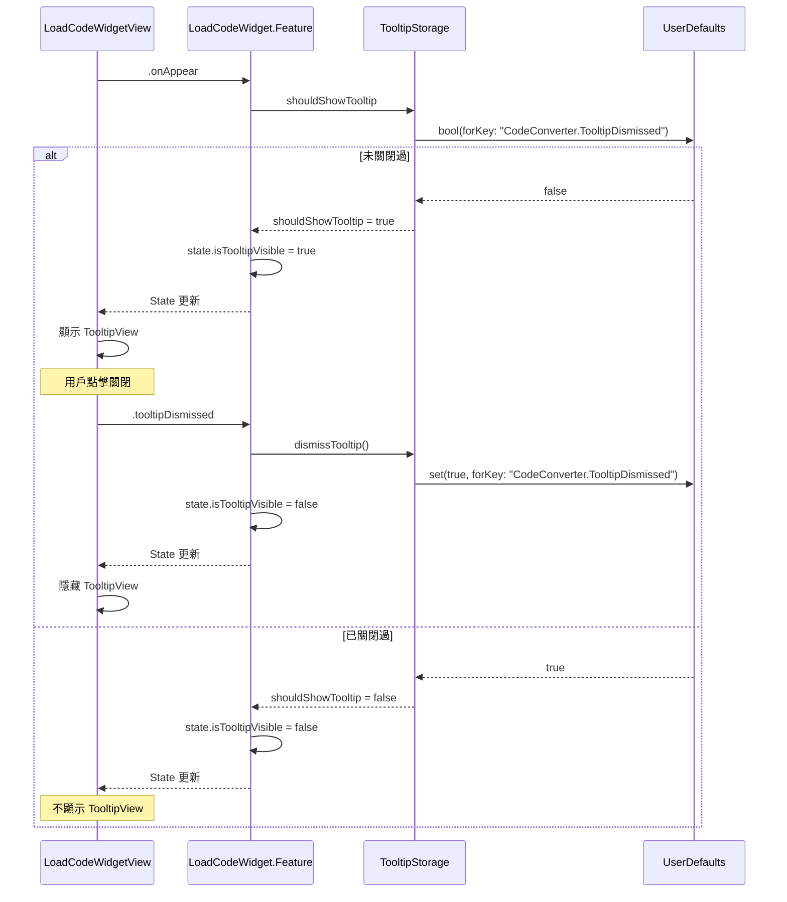

# Module Sequence Diagram: Tooltip Display Logic

## 觸發時機

Load Code Widget 出現時，檢查是否需要顯示引導 Tooltip。

---

## 1️⃣ User-Facing Sequence Diagram

此圖展示從用戶視角的 Tooltip 顯示流程。



<details>
<summary>📝 Mermaid 語法</summary>

```text
sequenceDiagram
    actor User
    
    box rgb(173, 216, 230) App
        participant Widget as Load Code Widget
        participant Tooltip as Tooltip View
    end
    
    participant Storage as Device Storage

    %% Widget 出現
    rect rgb(255, 250, 240)
        note over User,Storage: Tooltip 顯示邏輯
        note over Widget: 📐 Figma: 1.0.0 Homepage Load Code Tooltip
        
        Widget->>Storage: 檢查 Device ID 是否已關閉 Tooltip
        
        alt 首次使用（未關閉過）
            Storage-->>Widget: shouldShowTooltip = true
            Widget->>Tooltip: 顯示 Tooltip
            note over Tooltip: 💡 "Insert a booking code from any provider"
            
            User->>Tooltip: 點擊關閉按鈕 (✕)
            Tooltip->>Storage: 儲存 Device ID（標記已關閉）
            Tooltip-->>Widget: 隱藏 Tooltip
            note over Widget: Tooltip 不再顯示
            
        else 已關閉過
            Storage-->>Widget: shouldShowTooltip = false
            note over Widget: 不顯示 Tooltip
        end
    end
```

</details>

### Figma Frame 對應表

| 流程階段 | Figma Frame | Node ID |
|----------|-------------|---------|
| Tooltip 顯示 | 1.0.0 | `Homepage Load Code Tooltip` |

---

## 2️⃣ Codebase-Level Sequence Diagram

此圖展示 Clean Architecture 各層之間的呼叫關係。



<details>
<summary>📝 Mermaid 語法</summary>

```text
sequenceDiagram
    participant UI as LoadCodeWidgetView
    participant Feature as LoadCodeWidget.Feature
    participant Storage as TooltipStorage
    participant UserDefaults as UserDefaults

    UI->>Feature: .onAppear
    
    Feature->>Storage: shouldShowTooltip
    Storage->>UserDefaults: bool(forKey: "CodeConverter.TooltipDismissed")
    
    alt 未關閉過
        UserDefaults-->>Storage: false
        Storage-->>Feature: shouldShowTooltip = true
        Feature->>Feature: state.isTooltipVisible = true
        Feature-->>UI: State 更新
        UI->>UI: 顯示 TooltipView
        
        Note over UI: 用戶點擊關閉
        UI->>Feature: .tooltipDismissed
        Feature->>Storage: dismissTooltip()
        Storage->>UserDefaults: set(true, forKey: "CodeConverter.TooltipDismissed")
        Feature->>Feature: state.isTooltipVisible = false
        Feature-->>UI: State 更新
        UI->>UI: 隱藏 TooltipView
        
    else 已關閉過
        UserDefaults-->>Storage: true
        Storage-->>Feature: shouldShowTooltip = false
        Feature->>Feature: state.isTooltipVisible = false
        Feature-->>UI: State 更新
        Note over UI: 不顯示 TooltipView
    end
```

</details>

---

## Tooltip 行為規格

### 顯示規則

| 項目 | 說明 |
|------|------|
| **顯示條件** | 功能上線後首次使用，且未關閉過 |
| **顯示位置** | Load Code Widget 輸入框上方 |
| **跨入口同步** | 任一入口關閉後，所有入口皆不再顯示 |

### 儲存機制

| 項目 | 說明 |
|------|------|
| **儲存位置** | UserDefaults (App Sandbox) |
| **Key** | `CodeConverter.TooltipDismissed` |
| **Value** | `Bool` (true = 已關閉) |
| **跨裝置同步** | 不同步（每個 Device 獨立） |
| **重裝 App** | 會重置（首次安裝顯示 Tooltip） |

### 入口點列表

| 入口 | 說明 |
|------|------|
| 首頁 Widget | Homepage 的 Load Code Section |
| Code Center | Load Code Tab |
| Betslip Empty | 空 Betslip 狀態 |

---

## State 變更

| Before | After |
|--------|-------|
| `isTooltipVisible = ?` | `isTooltipVisible = !storage.isDismissed` |

---

## Code 實作參考

### TooltipStorage

```swift
struct TooltipStorage {
    private let userDefaults: UserDefaults
    private let key = "CodeConverter.TooltipDismissed"
    
    init(userDefaults: UserDefaults = .standard) {
        self.userDefaults = userDefaults
    }
    
    var shouldShowTooltip: Bool {
        !userDefaults.bool(forKey: key)
    }
    
    func dismissTooltip() {
        userDefaults.set(true, forKey: key)
    }
}
```

### State

```swift
@ObservableState
struct State: Equatable {
    // ... 其他屬性
    
    /// Tooltip 是否顯示
    var isTooltipVisible: Bool = false
}
```

### Action

```swift
enum Action: Equatable {
    // ... 其他 Action
    
    /// Tooltip 被關閉
    case tooltipDismissed
}
```

### Reducer

```swift
case .onAppear:
    state.isTooltipVisible = tooltipStorage.shouldShowTooltip
    return .none

case .tooltipDismissed:
    tooltipStorage.dismissTooltip()
    state.isTooltipVisible = false
    return .none
```

### TooltipView

```swift
struct TooltipView: View {
    let onDismiss: () -> Void
    
    var body: some View {
        HStack {
            Text("💡 Insert a booking code from any provider")
                .font(.caption)
                .foregroundColor(.white)
            
            Spacer()
            
            Button(action: onDismiss) {
                Image(systemName: "xmark")
                    .foregroundColor(.white.opacity(0.7))
            }
        }
        .padding(.horizontal, 12)
        .padding(.vertical, 8)
        .background(Color.black.opacity(0.8))
        .cornerRadius(8)
    }
}
```

