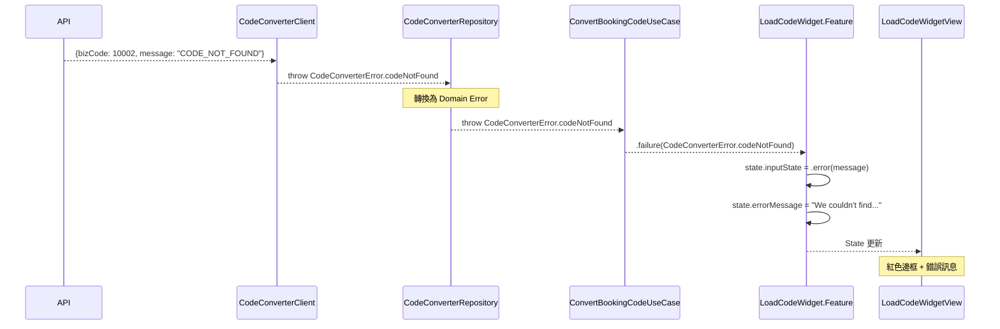
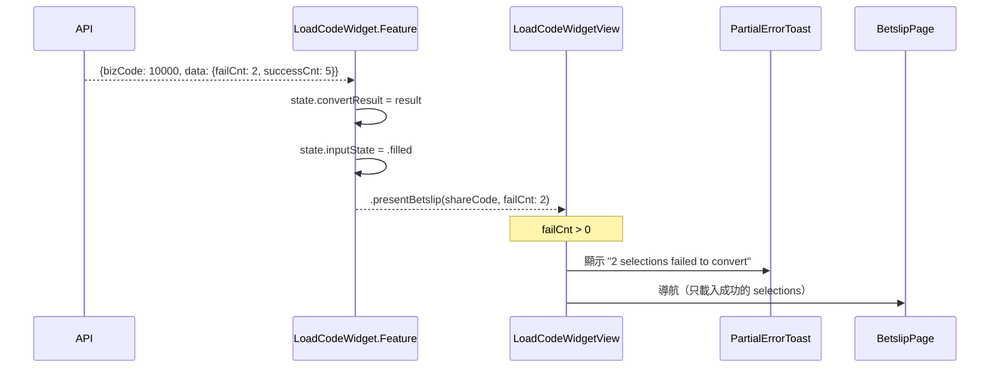
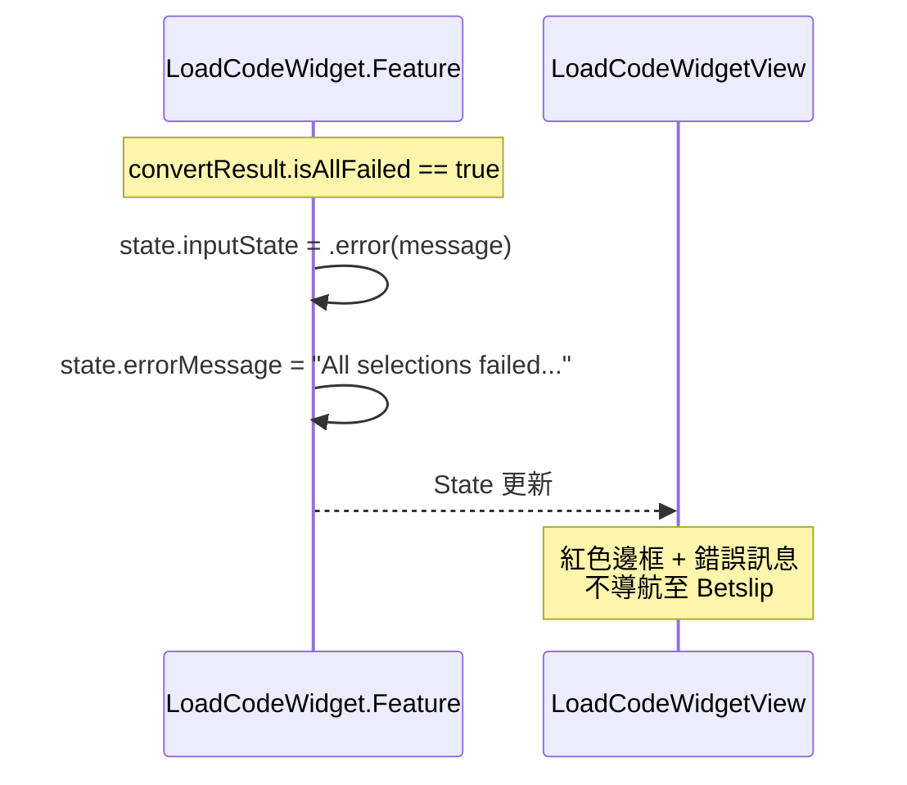

# Error Handling

## ⚠️ BE 新設計更新 (2025-01-14)

| 變更項目 | 說明 |
|----------|------|
| **移除 Provider/Country 錯誤** | `unsupportedProvider`, `unsupportedCountry` 已廢棄 |
| **簡化 codeNotFound** | 不再帶 `bookieName` 參數 |

---

## 錯誤類型定義

```swift
enum CodeConverterError: LocalizedError, Equatable {
    /// 參數錯誤
    case invalidParameter
    
    /// 找不到 Booking Code（對應 bizCode: 10002）
    case codeNotFound
    
    /// 所有 selections 都轉換失敗
    case allSelectionsFailed
    
    /// 網路錯誤
    case networkError(message: String)
    
    /// 請求逾時（對應 bizCode: 10005）
    case timeout
    
    /// 伺服器錯誤（對應 bizCode: 10006）
    case internalError
    
    /// 未知錯誤
    case unknown
    
    var errorDescription: String? {
        switch self {
        case .invalidParameter:
            return "Invalid parameter. Please try again."
        case .codeNotFound:
            return "We couldn't find this booking code. Please check and try again."
        case .allSelectionsFailed:
            return "All selections failed to convert. Please try a different code."
        case .networkError(let message):
            return message.isEmpty ? "Network error. Please check your connection and try again." : message
        case .timeout:
            return "Request timeout. Please try again."
        case .internalError:
            return "Internal error. Please try again later."
        case .unknown:
            return "An unexpected error occurred. Please try again."
        }
    }
    
    static func from(bizCode: Int) -> CodeConverterError {
        switch bizCode {
        case 10001: return .invalidParameter
        case 10002: return .codeNotFound
        case 10005: return .timeout
        case 10006: return .internalError
        default: return .unknown
        }
    }
}
```

### 廢棄的錯誤類型

```swift
// ❌ 廢棄 - 不再需要
// case unsupportedProvider
// case unsupportedCountry
// case codeNotFound(bookieName: String)  // 簡化為不帶參數
```

---

## API Error Code 對照

| bizCode | HTTP Status | CodeConverterError | UI 顯示 |
|---------|-------------|-------------------|---------|
| 10001 | 400 | `.invalidParameter` | 參數錯誤 |
| 10002 | 200 | `.codeNotFound` | 找不到 Code（紅框 + 訊息） |
| ~~10003~~ | ~~400~~ | ~~`.unsupportedProvider`~~ | ❌ 廢棄 |
| ~~10004~~ | ~~400~~ | ~~`.unsupportedCountry`~~ | ❌ 廢棄 |
| 10005 | 200 | `.timeout` | 請求逾時 |
| 10006 | 200 | `.internalError` | 內部錯誤 |
| - | 5xx | `.internalError` | 伺服器錯誤 |
| - | timeout | `.networkError` | 網路錯誤 |

---

## 錯誤處理流程

### 1. Code Not Found (bizCode: 10002)



---

### 2. Partial Failure (成功但部分失敗)



---

### 3. All Selections Failed



---

## UI 錯誤狀態

### inputState == .error(message)

| 元件 | 變化 |
|------|------|
| 輸入框邊框 | 紅色 (#fb4d3d) |
| 清除按鈕 | 顯示 ⊗ |
| Load 按鈕 | 綠色（可重試） |
| 錯誤訊息 | 輸入框下方紅色文字 |

### 視覺規格

```swift
// 錯誤邊框
.overlay(
    RoundedRectangle(cornerRadius: 10)
        .stroke(Color.warningPrimary, lineWidth: 1)
)

// 錯誤訊息
Text(errorMessage)
    .font(.system(size: 12))
    .foregroundColor(.warningPrimary)
    .padding(.top, 8)
```

---

## 錯誤恢復

### 用戶操作 → 清除錯誤

| 用戶操作 | 結果 |
|----------|------|
| 點擊輸入框 | `inputState = .focus`，清除 errorMessage |
| 修改輸入 | `inputState = .typing`，清除 errorMessage |
| 點擊清除按鈕 | 清除輸入 + errorMessage，`inputState = .focus` |

### Reducer 實作

```swift
case .bookingCodeChanged(let rawCode):
    let filteredCode = manager.filterBookingCode(rawCode)
    state.bookingCode = filteredCode
    
    // 清除錯誤狀態
    if state.inputState.isError {
        state.inputState = filteredCode.isEmpty ? .focus : .typing
        state.errorMessage = nil
    } else {
        state.inputState = filteredCode.isEmpty ? .focus : .typing
    }
    return .none

case .clearButtonTapped:
    state.bookingCode = ""
    state.inputState = .focus
    state.errorMessage = nil  // 清除錯誤
    return .none

case .inputFocused:
    if state.inputState.isError {
        // 聚焦時不清除錯誤，讓用戶看到訊息
    } else {
        state.inputState = .focus
    }
    return .none
```

---

## Partial Error Toast

### 顯示時機

當 `convertResult.failCnt > 0 && convertResult.successCnt > 0` 時顯示。

### Toast 規格

```swift
struct PartialErrorToast: View {
    let failedCount: Int
    
    var body: some View {
        HStack(spacing: 4) {
            Image("icon/exclamation/2")
                .resizable()
                .frame(width: 12, height: 12)
                .foregroundColor(.white)
            
            Text("\(failedCount) selection\(failedCount > 1 ? "s" : "") failed to convert")
                .font(.system(size: 12))
                .foregroundColor(.white)
        }
        .padding(.horizontal, 16)
        .padding(.vertical, 12)
        .background(
            RoundedRectangle(cornerRadius: 10)
                .fill(Color.warningPrimary)
        )
        .shadow(color: Color.black.opacity(0.25), radius: 12, x: 0, y: 4)
    }
}
```

### 顯示邏輯

```swift
// 在 LoadCodeWidgetView 或 Parent View 中
.toast(isPresenting: $showPartialErrorToast) {
    PartialErrorToast(failedCount: store.convertResult?.failCnt ?? 0)
}

// 收到 .presentBetslip 時
case let .presentBetslip(shareCode, failCnt):
    if failCnt > 0 {
        state.showPartialErrorToast = true
    }
    // 導航至 Betslip
    return .none
```

---

## 錯誤日誌

### Analytics Event

```swift
struct CodeConverterErrorEvent: AnalyticsEvent {
    let errorType: String
    let errorCode: String?
    let bookingCode: String  // 已遮蔽敏感資訊
    
    static func from(error: CodeConverterError, bookingCode: String) -> Self {
        Self(
            errorType: error.analyticsType,
            errorCode: error.analyticsCode,
            bookingCode: String(bookingCode.prefix(3)) + "***"  // 遮蔽
        )
    }
}

extension CodeConverterError {
    var analyticsType: String {
        switch self {
        case .invalidParameter: return "invalid_parameter"
        case .codeNotFound: return "code_not_found"
        case .allSelectionsFailed: return "all_failed"
        case .networkError: return "network_error"
        case .timeout: return "timeout"
        case .internalError: return "internal_error"
        case .unknown: return "unknown"
        }
    }
    
    var analyticsCode: String? {
        switch self {
        case .invalidParameter: return "10001"
        case .codeNotFound: return "10002"
        case .timeout: return "10005"
        case .internalError: return "10006"
        default: return nil
        }
    }
}
```

---

## 廢棄項目清單

| 項目 | 類型 | 原因 |
|------|------|------|
| `unsupportedProvider` | Error Case | 不再需要 Provider 驗證 |
| `unsupportedCountry` | Error Case | 不再需要 Country 驗證 |
| `codeNotFound(bookieName:)` | Error Case | 簡化為不帶 bookieName |
| Error Code 10003 | API Code | Provider 驗證已移除 |
| Error Code 10004 | API Code | Country 驗證已移除 |
