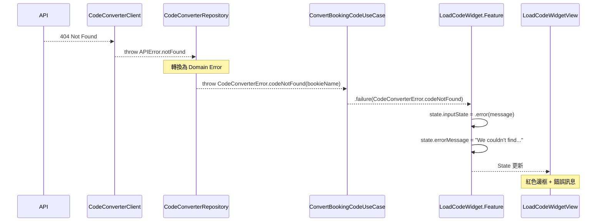
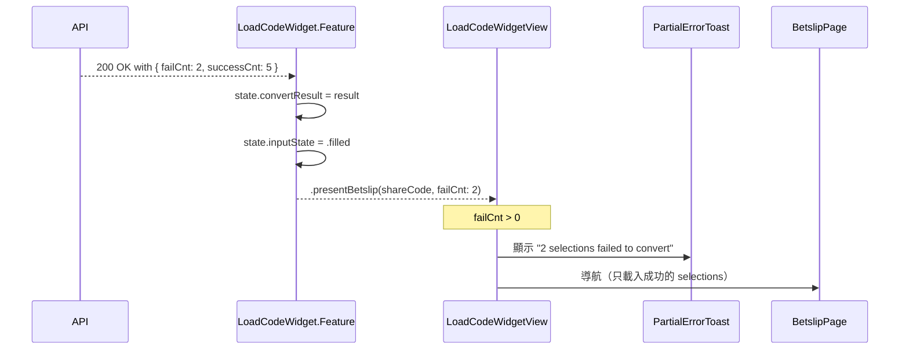
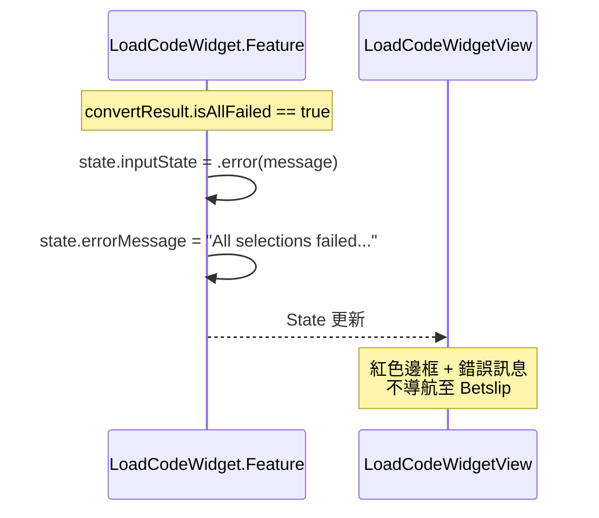

# Error Handling

## 錯誤類型定義

```swift
enum CodeConverterError: LocalizedError {
    /// 找不到 Booking Code（對應 API error code: CC002）
    case codeNotFound(bookieName: String)
    
    /// 所有 selections 都轉換失敗（對應 API error code: CC003）
    case allSelectionsFailed
    
    /// Provider 不支援
    case unsupportedProvider
    
    /// 國家不支援
    case unsupportedCountry
    
    /// 網路錯誤
    case networkError(underlying: Error)
    
    /// 伺服器錯誤
    case serverError(statusCode: Int, message: String?)
    
    /// 未知錯誤
    case unknown(underlying: Error)
    
    var errorDescription: String? {
        switch self {
        case .codeNotFound(let bookieName):
            return "We couldn't find this booking code on \(bookieName). Please check and try again."
        case .allSelectionsFailed:
            return "All selections failed to convert. Please try a different code."
        case .unsupportedProvider:
            return "This bookie is not supported."
        case .unsupportedCountry:
            return "This country is not supported."
        case .networkError:
            return "Network error. Please check your connection and try again."
        case .serverError(_, let message):
            return message ?? "Server error. Please try again later."
        case .unknown:
            return "An unexpected error occurred. Please try again."
        }
    }
}
```

---

## API Error Code 對照

| API Error Code | HTTP Status | CodeConverterError | UI 顯示 |
|----------------|-------------|-------------------|---------|
| CC001 | 400 | `.unsupportedProvider` | 不支援的 Bookie |
| CC002 | 404 | `.codeNotFound(bookieName)` | 找不到 Code（紅框 + 訊息） |
| CC003 | 200 (partial) | `.allSelectionsFailed` | 全部失敗（紅框 + 訊息） |
| - | 5xx | `.serverError` | 伺服器錯誤 |
| - | timeout | `.networkError` | 網路錯誤 |

---

## 錯誤處理流程

### 1. Code Not Found (CC002)



---

### 2. Partial Failure (成功但部分失敗)



---

### 3. All Selections Failed (CC003)



---

## UI 錯誤狀態

### inputState == .error(message)

| 元件 | 變化 |
|------|------|
| 輸入框邊框 | 紅色 (#FF4444) |
| 清除按鈕 | 顯示 ⊗ |
| Load 按鈕 | 綠色（可重試） |
| 錯誤訊息 | 輸入框下方紅色文字 |
| Dropdown | 無變化 |

### 視覺規格

```swift
// 錯誤邊框
.overlay(
    RoundedRectangle(cornerRadius: 10)
        .stroke(Color.red, lineWidth: 2)
)

// 錯誤訊息
Text(errorMessage)
    .font(.system(size: 12))
    .foregroundColor(.red)
    .padding(.top, 8)
```

---

## 錯誤恢復

### 用戶操作 → 清除錯誤

| 用戶操作 | 結果 |
|----------|------|
| 點擊輸入框 | `inputState = .focus`，清除 errorMessage |
| 修改輸入 | `inputState = .typing`，清除 errorMessage |
| 點擊清除按鈕 | 清除輸入 + errorMessage，`inputState = .focus` |
| 選擇新 Bookie | 保持輸入，清除 errorMessage |

### Reducer 實作

```swift
case .bookingCodeChanged(let rawCode):
    let filteredCode = manager.filterBookingCode(rawCode)
    state.bookingCode = filteredCode
    
    // 清除錯誤狀態
    if state.inputState.isError {
        state.inputState = filteredCode.isEmpty ? .focus : .typing
        state.errorMessage = nil
    } else {
        state.inputState = filteredCode.isEmpty ? .focus : .typing
    }
    return .none

case .clearButtonTapped:
    state.bookingCode = ""
    state.inputState = .focus
    state.errorMessage = nil  // 清除錯誤
    return .none

case .inputFocused:
    if state.inputState.isError {
        // 聚焦時不清除錯誤，讓用戶看到訊息
    } else {
        state.inputState = .focus
    }
    return .none
```

---

## Partial Error Toast

### 顯示時機

當 `convertResult.failCnt > 0 && convertResult.successCnt > 0` 時顯示。

### Toast 規格

```swift
struct PartialErrorToast: View {
    let failedCount: Int
    
    var body: some View {
        HStack(spacing: 8) {
            Image(systemName: "exclamationmark.triangle.fill")
                .foregroundColor(.orange)
            
            Text("\(failedCount) selection\(failedCount > 1 ? "s" : "") failed to convert")
                .font(.system(size: 14))
                .foregroundColor(.white)
        }
        .padding(.horizontal, 16)
        .padding(.vertical, 12)
        .background(
            RoundedRectangle(cornerRadius: 8)
                .fill(Color.black.opacity(0.8))
        )
    }
}
```

### 顯示邏輯

```swift
// 在 LoadCodeWidgetView 或 Parent View 中
.toast(isPresenting: $showPartialErrorToast) {
    PartialErrorToast(failedCount: store.convertResult?.failCnt ?? 0)
}

// 收到 .presentBetslip 時
case let .presentBetslip(shareCode, failCnt):
    if failCnt > 0 {
        state.showPartialErrorToast = true
    }
    // 導航至 Betslip
    return .none
```

---

## 錯誤日誌

### Analytics Event

```swift
struct CodeConverterErrorEvent: AnalyticsEvent {
    let errorType: String
    let errorCode: String?
    let provider: String
    let country: String
    let bookingCode: String  // 已遮蔽敏感資訊
    
    static func from(error: CodeConverterError, input: ConvertBookingCodeInput) -> Self {
        Self(
            errorType: error.analyticsType,
            errorCode: error.analyticsCode,
            provider: input.provider,
            country: input.country,
            bookingCode: input.bookingCode.prefix(3) + "***"  // 遮蔽
        )
    }
}

extension CodeConverterError {
    var analyticsType: String {
        switch self {
        case .codeNotFound: return "code_not_found"
        case .allSelectionsFailed: return "all_failed"
        case .networkError: return "network_error"
        case .serverError: return "server_error"
        default: return "unknown"
        }
    }
    
    var analyticsCode: String? {
        switch self {
        case .codeNotFound: return "CC002"
        case .allSelectionsFailed: return "CC003"
        case .serverError(let code, _): return "HTTP_\(code)"
        default: return nil
        }
    }
}
```
