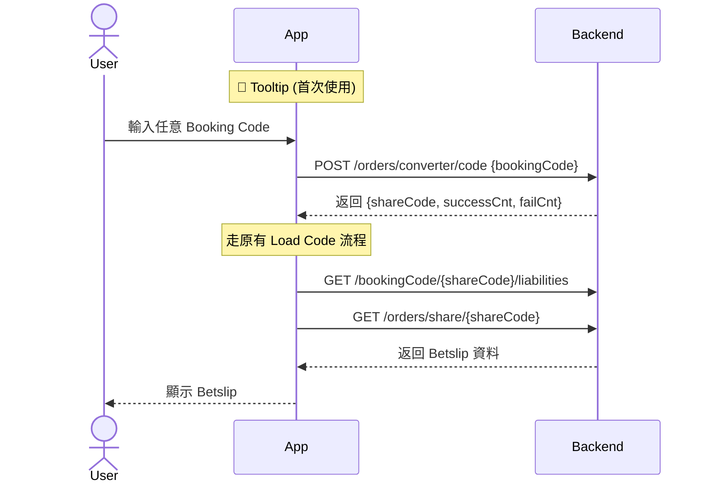

# Code Converter Phase 1 - Technical Design Document

> **功能**: Booking Code Converter (Code2Code)  
> **版本**: Phase 1  
> **最後更新**: 2025-01-14

---

## ⚠️ BE 新設計更新 (2025-01-14)

| 變更項目 | 說明 |
|----------|------|
| **Config API 廢棄** | ~~`GET /orders/converter/config/providerCountries`~~ 不再使用 |
| **Provider/Country 移除** | Convert API 只需 `bookingCode`，BE 自動識別 |
| **Bookie Selector 廢棄** | 不再需要選擇 Bookie 流程 |
| **Tooltip 新增** | 首次使用顯示引導，以 Device ID 儲存 |

---

## 🎯 功能概述

Code Converter 讓用戶可以將任意 Booking Code 轉換為 Fcom 的 Share Code，並直接載入到 Betslip 進行投注。

### 核心流程



---

## 📚 文件導覽

### 快速開始

| 章節 | 說明 |
|------|------|
| [Overview](./00_Overview/01_overview.md) | 功能概述、復用策略、實作優先級 |
| [Sprint Plan](./12_Sprint%20Plan/01_5day_sprint_plan.md) | 5 天開發計劃與 Jira Tickets |

### 架構設計

| 章節 | 說明 |
|------|------|
| [完整流程序列圖](./01_Integrated%20Service-Level%20Sequence%20Diagram/01_full_integration_flow.md) | 端到端的服務流程 |
| [Clean Architecture](./02_Architecture/01_clean_architecture_diagram.md) | 分層架構圖 |
| [模組職責](./03_Module%20Responsibility/01_module_responsibility.md) | 各模組的職責定義 |

### View Layer

| 章節 | 說明 |
|------|------|
| [View 實作](./05_Module%20Sequence%20Diagram/LoadBookingCodeSection/01_view_implementation.md) | SwiftUI View 實作細節 |
| [設計規格](./05_Module%20Sequence%20Diagram/LoadBookingCodeSection/02_view_design_specs.md) | Figma 設計規格（顏色、字型、間距） |
| [State ↔ Figma 對照](./05_Module%20Sequence%20Diagram/LoadBookingCodeSection/03_state_to_figma_mapping.md) | State 與 Figma Node 對照表 |
| [⭐ UI 替換策略](./05_Module%20Sequence%20Diagram/LoadBookingCodeSection/05_ui_replacement_strategy_01_09.md) | 01_09 版本 UI 替換策略 |
| [🆕 Tooltip 邏輯](./05_Module%20Sequence%20Diagram/Module%20Sequence%20Diagrams/04_tooltip_display_logic.md) | Tooltip 顯示邏輯 |

### Domain Layer

| 章節 | 說明 |
|------|------|
| [Domain Model](./04_Domain%20Model/01_domain_model.md) | Domain 模型定義 |
| [TCA State & Action](./06_Feature%20State%20and%20Action%20(TCA)/01_feature_state_action.md) | TCA Feature 定義 |
| [UseCase I/O](./07_UseCase%20Input%20and%20Output%20Model/01_usecase_input_output.md) | UseCase 輸入輸出模型 |

### Data Layer

| 章節 | 說明 |
|------|------|
| [API 規格](./08_API%20Spec%20and%20Mapping/01_api_spec.md) | API Endpoints 規格 |
| [DTO Mapping](./08_API%20Spec%20and%20Mapping/02_dto_mapping.md) | DTO 與 Domain Model 映射 |

### 其他

| 章節 | 說明 |
|------|------|
| [Error Handling](./09_Error%20Handling/01_error_handling.md) | 錯誤處理策略 |
| [Test Scenarios](./10_Test%20Scenarios/01_test_scenarios.md) | 測試情境與範例 |
| [Risks & Questions](./11_Risks%20and%20Questions/01_risks_and_questions.md) | 風險評估與待確認事項 |

---

## 🏗️ 架構總覽

```
┌─────────────────────────────────────────────────────────────┐
│                        UI Layer                             │
│  LoadBookingCodeSectionView │ TooltipView │ PartialErrorToast │
└────────────────────────────┬────────────────────────────────┘
                             │
┌────────────────────────────▼────────────────────────────────┐
│                      Domain Layer (TCA)                      │
│  ┌─────────────────────────────────────────────────────────┐ │
│  │  LoadBookingCodeSection.Feature (擴展)                   │ │
│  └──────────────────────────┬──────────────────────────────┘ │
│                             │                                │
│            ┌────────────────▼────────────────┐               │
│            │ ConvertBookingCodeUseCase       │               │
│            └────────────────┬────────────────┘               │
└─────────────────────────────┼────────────────────────────────┘
                              │
┌─────────────────────────────▼────────────────────────────────┐
│                   Data & Infrastructure                      │
│  CodeConverterRepository │ CodeConverterClient │ API         │
│  TooltipStorage (UserDefaults)                               │
└─────────────────────────────────────────────────────────────┘
```

### 廢棄項目

| 項目 | 類型 | 原因 |
|------|------|------|
| ~~BookieSelectorSheet~~ | UI | 不再需要選擇 Bookie |
| ~~LoadProviderConfigUseCase~~ | UseCase | Config API 已廢棄 |
| ~~Config API~~ | API | BE 新設計不需要 |

---

## 📅 開發時程

| Phase | 內容 | 時程 |
|-------|------|------|
| **Phase 1.1** | 擴展現有元件 + Tooltip | Day 1-2 |
| **Phase 1.2** | 新增 Data Layer | Day 2-3 |
| **Phase 1.3** | 替換入口點 | Day 4 |
| **Phase 1.4** | 清理 & 測試 | Day 5 |

---

## 🔗 相關連結

- **Epic**: [FOOTBALL-9161](https://jira.example.com/browse/FOOTBALL-9161)
- **Figma**: [Code-Converter](https://www.figma.com/design/SvcTlADMZ7gUPIa7nN2hT1/Code-Converter)
- **PRD**: 參見 `/PRDs/01_PRD/01_06/`
